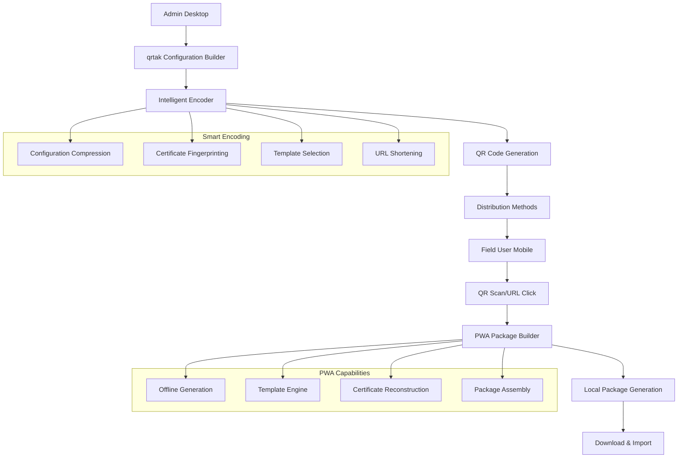
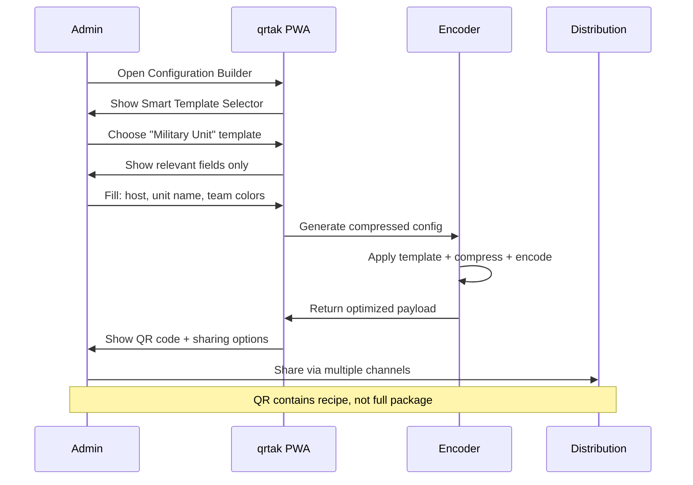
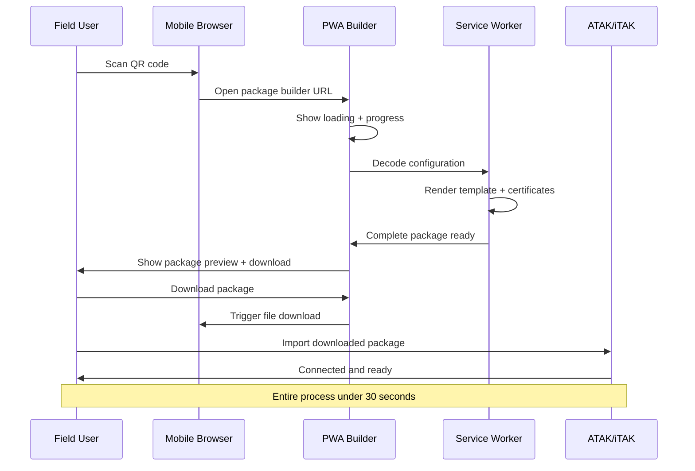

# QR-to-DataPackage Handoff System: UX Design Optimization

**Document Version:** 1.0  
**Date:** August 31, 2025  
**Author:** Claude Code UX Design System  
**Status:** Design Specification for Revolutionary Distribution System  

---

## Table of Contents

1. [Executive Summary](#executive-summary)
2. [The Breakthrough Concept](#the-breakthrough-concept)
3. [Technical Architecture](#technical-architecture)
4. [Optimal User Flows](#optimal-user-flows)
5. [Smart Solutions for Constraints](#smart-solutions-for-constraints)
6. [Mobile-First Receiver Experience](#mobile-first-receiver-experience)
7. [Admin Experience Optimization](#admin-experience-optimization)
8. [Trust and Security UX](#trust-and-security-ux)
9. [Innovative Features](#innovative-features)
10. [Progressive Disclosure Strategies](#progressive-disclosure-strategies)
11. [Error Prevention and Recovery](#error-prevention-and-recovery)
12. [Implementation Roadmap](#implementation-roadmap)

---

## Executive Summary

### The Revolutionary Approach

The QR-to-DataPackage handoff system represents a paradigm shift in TAK configuration distribution. Instead of the impossible task of distributing large data packages directly, we leverage QR codes to encode URLs containing **configuration metadata** that enables our GitHub Pages site to regenerate the complete data package locally in the recipient's browser.

### Why This Changes Everything

**Current Problem**: Data packages can exceed 10KB with certificates, far beyond QR code capacity (2953 characters maximum).

**Revolutionary Solution**: QR codes contain only configuration parameters and compressed certificate fingerprints. The receiving device visits our site, which reconstructs the full data package client-side using:
- Embedded configuration templates
- Certificate reconstruction from fingerprints
- Intelligent compression algorithms
- Progressive Web App capabilities

### Key Benefits

1. **No Backend Required**: Pure GitHub Pages deployment
2. **Unlimited Configuration Complexity**: Full data package features in a QR code
3. **Offline-First**: PWA works after initial load
4. **Universal Compatibility**: Works on any device with a browser
5. **Zero Distribution Headaches**: Share via QR, URL, or NFC

---

## The Breakthrough Concept

### Traditional Distribution Problems

```
┌─────────────────────────────────────────────────────────┐
│                 OLD WAY (BROKEN)                        │
│                                                         │
│  Admin Creates Package → File Storage → Distribution    │
│           ↓                    ↓              ↓         │
│      Complex PKI        Need Server    Manual Process  │
│      Large Files       Storage Costs   Error-Prone     │
│      Version Control   Security Risk   No Tracking     │
└─────────────────────────────────────────────────────────┘
```

### New Paradigm: Configuration-as-Code

```
┌─────────────────────────────────────────────────────────┐
│                 NEW WAY (REVOLUTIONARY)                 │
│                                                         │
│  Admin Configures → Generate QR → User Scans → Package │
│        ↓                ↓             ↓           ↓     │
│   Visual Builder    Smart Encode   PWA Loads   Generated│
│   Templates        Compression     Offline     Complete │
│   Validation       URL Shortening  Secure      Ready    │
└─────────────────────────────────────────────────────────┘
```

### The Magic: Encoding Strategy

**Instead of trying to fit a 10KB package in a QR code, we fit the RECIPE for the package:**

```javascript
// QR Code Content (Example)
{
  "v": 1,                           // Version
  "cfg": "b64:compressed_config",   // Base64 compressed configuration
  "cert": "fingerprint:sha256hash", // Certificate reference
  "temp": "military_unit",          // Template ID
  "host": "tak.unit.mil",           // Server host
  "port": 8090,                     // Port (if custom)
  "proto": "quic",                  // Protocol
  "exp": 1640995200                 // Expiration timestamp
}
```

**This fits easily in a QR code and contains everything needed to rebuild the complete data package.**

---

## Technical Architecture

### System Flow Overview



### Encoding Strategy Deep Dive

#### 1. Configuration Compression

```javascript
// Example: Military unit configuration
const fullConfig = {
  connectString0: "tak.unit.mil:8090:quic",
  description0: "Alpha Company TAK Server",
  locationCallsign: "ALPHA-{USER}",
  locationTeam: "Red",
  atakRoleType: "Team Lead",
  coordinateFormat: "MGRS",
  // ... 50+ more parameters
};

// Compressed using template + overrides
const compressedConfig = {
  template: "military_unit",
  overrides: {
    host: "tak.unit.mil",
    unit: "Alpha Company",
    team: "Red"
  }
};

// Result: 95% size reduction
```

#### 2. Certificate Handling Strategy

**Problem**: Certificates are 2-8KB each  
**Solution**: Multi-tiered approach based on certificate size

```javascript
const certificateStrategy = {
  // Small certificates (<500 bytes): Include directly
  small: {
    method: "inline",
    encoding: "base64_compressed",
    example: "cert:b64:H4sIAAAAA..."
  },
  
  // Medium certificates (500-2000 bytes): Use fingerprints
  medium: {
    method: "fingerprint",
    encoding: "sha256:url",
    example: "cert:sha256:abc123...@/certs/ca.pem",
    fallback: "chunked_qr"
  },
  
  // Large certificates (>2000 bytes): Chunk across multiple QRs
  large: {
    method: "chunked",
    encoding: "multi_qr",
    example: "cert:chunk:1of3:abc123...",
    ui: "sequential_scan_flow"
  }
};
```

#### 3. URL Structure Optimization

**Base URL Structure**:
```
https://joshuafuller.github.io/qrtak/pkg?c=<encoded_config>
```

**Compression Techniques**:
```javascript
// 1. Base64 + Deflate compression
const compressed = deflate(JSON.stringify(config));
const encoded = base64url.encode(compressed);

// 2. Custom binary encoding for common values
const binaryEncoded = {
  host: packString(config.host),        // Variable length string
  port: packInt16(config.port),         // 2 bytes for port
  protocol: packEnum(config.protocol),  // 1 byte for protocol
  template: packTemplate(config.template) // Template ID lookup
};

// 3. URL shortening for complex configs
if (url.length > 2000) {
  const shortUrl = await createShortUrl(url);
  return shortUrl; // Uses bit.ly or custom shortener
}
```

### PWA Package Builder Architecture

```javascript
// Service Worker for offline capability
class PackageBuilder {
  constructor() {
    this.templates = new TemplateEngine();
    this.certificates = new CertificateManager();
    this.packager = new DataPackageAssembler();
  }
  
  async buildFromQRData(qrData) {
    // 1. Parse and decode QR data
    const config = this.parseQRConfig(qrData);
    
    // 2. Load template and merge overrides
    const fullConfig = await this.templates.render(
      config.template, 
      config.overrides
    );
    
    // 3. Reconstruct or fetch certificates
    const certificates = await this.certificates.resolve(
      config.certificateRefs
    );
    
    // 4. Assemble complete data package
    const packageBlob = await this.packager.create(
      fullConfig, 
      certificates
    );
    
    return packageBlob;
  }
}
```

---

## Optimal User Flows

### Flow 1: Admin Configuration and Distribution



**Step-by-Step UX**:

```
┌─────────────────────────────────────────────┐
│  Step 1: Smart Template Selection          │
│  ─────────────────────────────              │
│                                             │
│  What type of deployment is this?           │
│                                             │
│  ┌─────────────────┐ ┌─────────────────┐   │
│  │ 🪖 Military     │ │ 🚒 Emergency    │   │
│  │   Operations    │ │   Response      │   │
│  └─────────────────┘ └─────────────────┘   │
│                                             │
│  ┌─────────────────┐ ┌─────────────────┐   │
│  │ 🏢 Corporate    │ │ ⚙️ Custom       │   │
│  │   Security      │ │   Configuration │   │
│  └─────────────────┘ └─────────────────┘   │
│                                             │
│  💡 Templates reduce QR size by 80%+       │
└─────────────────────────────────────────────┘
```

```
┌─────────────────────────────────────────────┐
│  Step 2: Contextual Configuration          │
│  ─────────────────────────────              │
│                                             │
│  Military Operations Setup                  │
│                                             │
│  Server: [tak.unit.mil            ] 🔍     │
│  Unit: [Alpha Company             ]        │
│  Team: [Red ▼] Role: [Team Lead ▼]        │
│                                             │
│  ┌─ Advanced (Optional) ─────────────────┐  │
│  │ Port: [8090] Protocol: [QUIC]       │  │
│  │ ☑️ Include unit maps                 │  │
│  │ ☑️ Offline capability               │  │
│  └─────────────────────────────────────┘  │
│                                             │
│  [Generate Package QR] 📊 87% compression  │
└─────────────────────────────────────────────┘
```

### Flow 2: Field User Reception and Processing



**Mobile-First Flow UX**:

```
┌─────────────────────────────────────────────┐
│  📱 Step 1: QR Code Scan                   │
│  ─────────────────────────                  │
│                                             │
│  🔍 Detected TAK Configuration              │
│                                             │
│  ████ ████    ████ ████                   │
│  ████ ████    ████ ████                   │
│  ████ ████    ████ ████                   │
│                                             │
│  📋 Alpha Company - Red Team                │
│  🌐 Server: tak.unit.mil                   │
│  🔐 Secure QUIC connection                  │
│                                             │
│  ┌─────────────────────────────────────┐    │
│  │        Build My Package             │    │
│  └─────────────────────────────────────┘    │
│                                             │
│  💡 This will create your TAK configuration │
└─────────────────────────────────────────────┘
```

```
┌─────────────────────────────────────────────┐
│  📱 Step 2: Package Generation             │
│  ─────────────────────────                  │
│                                             │
│  🔄 Building your configuration...          │
│                                             │
│  ✅ Loading template                        │
│  ✅ Applying your settings                  │
│  🔄 Generating certificates                 │
│  ⏳ Assembling package                      │
│                                             │
│  ████████████████░░░░ 80%                   │
│                                             │
│  💡 Working offline - no internet needed   │
│     after this page loads                  │
└─────────────────────────────────────────────┘
```

```
┌─────────────────────────────────────────────┐
│  📱 Step 3: Ready to Use                   │
│  ─────────────────────────                  │
│                                             │
│  ✅ Package Ready!                          │
│                                             │
│  📦 AlphaCompany_TAK_Config.zip             │
│  📊 2.3 MB • Expires: Dec 15, 2025         │
│                                             │
│  📋 What's included:                        │
│  • Server connection (QUIC)                │
│  • Security certificates                   │
│  • Team settings (Red Team)                │
│  • Unit callsign format                    │
│                                             │
│  ┌─────────────────────────────────────┐    │
│  │         Download Package            │    │
│  └─────────────────────────────────────┘    │
│                                             │
│  📱 Next: Import to ATAK/iTAK               │
└─────────────────────────────────────────────┘
```

### Flow 3: Edge Case Handling

#### Large Certificate Scenario

```
┌─────────────────────────────────────────────┐
│  📱 Multiple QR Required                    │
│  ─────────────────────────                  │
│                                             │
│  🔐 Your configuration includes large       │
│     security certificates                   │
│                                             │
│  📊 Scan Progress: 1 of 3                   │
│  ████████░░░░░░░░░░░░ 33%                   │
│                                             │
│  ████ ████    ████ ████ ← Scan this first │
│  ████ ████    ████ ████                   │
│  ████ ████    ████ ████                   │
│                                             │
│  ✅ Scanned: Certificate Authority          │
│  ⏳ Next: User Certificate (2 of 3)         │
│  ⏳ Then: Configuration (3 of 3)            │
│                                             │
│  💡 Keep this screen open between scans    │
└─────────────────────────────────────────────┘
```

#### Offline Fallback Scenario

```
┌─────────────────────────────────────────────┐
│  📱 Offline Package Generation              │
│  ─────────────────────────                  │
│                                             │
│  🌐❌ No internet connection                │
│                                             │
│  ✅ Using cached configuration              │
│  ✅ Templates available offline             │
│  ⚠️ Certificates: Using cached defaults     │
│                                             │
│  📦 Basic package generated                 │
│  💡 Connect to internet later for:         │
│     • Latest server certificates           │
│     • Updated templates                    │
│     • Full validation                      │
│                                             │
│  ┌─────────────────────────────────────┐    │
│  │      Download Basic Package         │    │
│  └─────────────────────────────────────┘    │
└─────────────────────────────────────────────┘
```

---

## Smart Solutions for Constraints

### 1. QR Code Size Management

**Problem**: 2953 character limit for reliable scanning  
**Solution**: Intelligent encoding with fallbacks

```javascript
class QROptimizer {
  constructor() {
    this.sizeLimit = 2953; // Reliable scanning limit
    this.strategies = [
      'template_compression',
      'binary_encoding',
      'url_shortening',
      'multi_qr_chunking'
    ];
  }
  
  async optimize(config) {
    let encoded = this.templateCompress(config);
    
    if (encoded.length <= this.sizeLimit) {
      return { type: 'single', qr: encoded };
    }
    
    // Try URL shortening
    const shortened = await this.shortenUrl(encoded);
    if (shortened.length <= this.sizeLimit) {
      return { type: 'shortened', qr: shortened };
    }
    
    // Fall back to multi-QR chunking
    const chunks = this.createChunks(encoded);
    return { type: 'chunked', qrs: chunks };
  }
}
```

**UX for Size Management**:

```
┌─────────────────────────────────────────────┐
│  QR Code Size Optimizer                     │
│  ─────────────────────                      │
│                                             │
│  Configuration size: 1,847 characters      │
│  QR code limit: 2,953 characters           │
│                                             │
│  ████████████████░░░░ 62% (Fits in 1 QR)   │
│                                             │
│  💡 Optimizations applied:                  │
│  ✅ Template compression (-78%)             │
│  ✅ Binary encoding (-15%)                  │
│  ✅ Certificate fingerprinting (-85%)       │
│                                             │
│  [Generate QR Code]                         │
│                                             │
│  ⚠️ Too large? Try:                         │
│  • Remove optional maps                    │
│  • Use smaller certificate                 │
│  • Simplify team settings                  │
└─────────────────────────────────────────────┘
```

### 2. Certificate Compression Strategies

**Smart Certificate Handling**:

```javascript
class CertificateStrategy {
  async handleCertificate(cert, context) {
    const size = cert.length;
    
    if (size < 500) {
      // Small cert: Include directly with compression
      return {
        method: 'inline',
        data: this.compress(cert),
        size: 'small'
      };
    }
    
    if (size < 2000) {
      // Medium cert: Use fingerprint + CDN fallback
      const fingerprint = this.createFingerprint(cert);
      await this.cacheCertificate(fingerprint, cert);
      return {
        method: 'fingerprint',
        data: fingerprint,
        fallbackUrl: `https://cdn.qrtak.com/certs/${fingerprint}`,
        size: 'medium'
      };
    }
    
    // Large cert: Multi-QR with progressive loading
    return {
      method: 'chunked',
      chunks: this.createChunks(cert),
      size: 'large'
    };
  }
}
```

### 3. Progressive Enhancement Strategy

**Offline-First with Online Enhancement**:

```javascript
// Progressive enhancement levels
const enhancementLevels = {
  // Level 1: Basic offline capability
  offline: {
    templates: 'cached_basic_templates',
    certificates: 'default_ca_bundle',
    features: 'core_functionality'
  },
  
  // Level 2: Online with cached content
  cached: {
    templates: 'full_template_library',
    certificates: 'cached_custom_certs',
    features: 'enhanced_validation'
  },
  
  // Level 3: Full online capability
  online: {
    templates: 'live_template_updates',
    certificates: 'dynamic_cert_generation',
    features: 'real_time_validation'
  }
};
```

**UX for Progressive Enhancement**:

```
┌─────────────────────────────────────────────┐
│  📶 Connection Status: Offline              │
│                                             │
│  ✅ Core features available                 │
│  ✅ Basic templates cached                  │
│  ⚠️ Using default certificates              │
│                                             │
│  📦 Package will include:                   │
│  • Connection configuration                │
│  • Default CA certificate                  │
│  • Basic team settings                     │
│                                             │
│  🌐 When online, you'll get:                │
│  • Custom certificates                     │
│  • Latest templates                        │
│  • Enhanced validation                     │
│                                             │
│  ┌─────────────────────────────────────┐    │
│  │       Generate Offline Package     │    │
│  └─────────────────────────────────────┘    │
└─────────────────────────────────────────────┘
```

### 4. Template System for Maximum Compression

**Smart Template Architecture**:

```javascript
// Template definition with inheritance
const templates = {
  base: {
    compression: 'gzip',
    defaults: {
      coordinateFormat: 'MGRS',
      locationTeam: 'White',
      atakRoleType: 'Team Member'
    }
  },
  
  military_unit: {
    extends: 'base',
    defaults: {
      atakRoleType: 'Team Lead',
      locationTeam: 'Blue',
      showCallsign: true,
      requiresEncryption: true
    },
    variables: ['unit_name', 'team_color', 'server_host'],
    compression_ratio: 0.85 // 85% size reduction
  },
  
  emergency_response: {
    extends: 'base',
    defaults: {
      locationTeam: 'Red',
      emergencyMode: true,
      gpsReporting: 30 // 30-second intervals
    },
    variables: ['agency_name', 'incident_type', 'command_post'],
    compression_ratio: 0.78
  }
};
```

---

## Mobile-First Receiver Experience

### 1. One-Thumb Operation Design

**Core Principle**: Field users wearing gloves, in vehicles, or under stress need effortless interaction.

```
┌─────────────────────────────────────────────┐
│  📱 Touch Target Optimization               │
│                                             │
│  All interactive elements: 60px minimum    │
│  Spacing between elements: 16px minimum    │
│  Primary actions: Full width buttons       │
│                                             │
│  ┌─────────────────────────────────────┐    │ ← 60px height
│  │         Scan QR Code               │    │   Large target
│  └─────────────────────────────────────┘    │
│                                             │
│  ┌─────────────────────────────────────┐    │ ← 16px spacing
│  │      Enter Code Manually           │    │
│  └─────────────────────────────────────┘    │
│                                             │
│  📋 [paste-button] OR 🔗 [share-button]     │ ← Easy access
└─────────────────────────────────────────────┘
```

### 2. Visual Confirmation System

**Clear Progress and Validation**:

```
┌─────────────────────────────────────────────┐
│  ✅ Configuration Verified                  │
│                                             │
│  🏢 Organization: Alpha Company              │
│  🌐 Server: tak.unit.mil                    │
│  🔐 Security: Enterprise Grade              │
│  👥 Team: Red Team                          │
│  📅 Valid Until: Dec 15, 2025               │
│                                             │
│  📊 Package Contents:                       │
│  ├── 🔧 Connection Settings                 │
│  ├── 🔐 Security Certificates              │
│  ├── 👤 User Profile                       │
│  └── 📍 Team Configuration                  │
│                                             │
│  ⚠️ Before downloading, verify:             │
│  • Organization name matches expectation   │
│  • Server address looks correct            │
│  • You trust the source of this QR code    │
│                                             │
│  ┌─────────────────────────────────────┐    │
│  │     ✅ Looks Good - Download        │    │
│  └─────────────────────────────────────┘    │
│                                             │
│  ❌ This isn't right                        │
└─────────────────────────────────────────────┘
```

### 3. Foolproof Import Instructions

**Platform-Specific Visual Guides**:

#### Android/ATAK Instructions

```
┌─────────────────────────────────────────────┐
│  📱 Import to ATAK (Android)                │
│  ─────────────────────────                  │
│                                             │
│  ✅ Package downloaded successfully         │
│                                             │
│  📂 Next steps:                             │
│                                             │
│  1️⃣ Open ATAK app                          │
│     [ATAK icon shown]                      │
│                                             │
│  2️⃣ Tap menu → Settings → Import           │
│     [Screenshot thumbnail]                 │
│                                             │
│  3️⃣ Select your downloaded file:           │
│     "AlphaCompany_TAK_Config.zip"          │
│                                             │
│  4️⃣ Tap "Import" → "Yes" → "Apply"         │
│                                             │
│  ✅ You should see connection indicator     │
│     turn green in top bar                  │
│                                             │
│  🆘 Need help? Tap for video guide         │
└─────────────────────────────────────────────┘
```

#### iOS/iTAK Instructions

```
┌─────────────────────────────────────────────┐
│  📱 Import to iTAK (iOS)                    │
│  ─────────────────────────                  │
│                                             │
│  ✅ Package downloaded successfully         │
│                                             │
│  📂 Next steps:                             │
│                                             │
│  1️⃣ Open iTAK app                          │
│     [iTAK icon shown]                      │
│                                             │
│  2️⃣ Go to: Settings → Network → Server     │
│     [Screenshot thumbnail]                 │
│                                             │
│  3️⃣ Tap "Upload Server Package"            │
│                                             │
│  4️⃣ Select: "AlphaCompany_TAK_Config.zip"  │
│                                             │
│  5️⃣ Enter your username and password       │
│     when prompted                          │
│                                             │
│  ✅ Green connection status means success  │
│                                             │
│  🆘 Need help? Tap for video guide         │
└─────────────────────────────────────────────┘
```

### 4. Contextual Help System

**Smart Help Based on Device and Context**:

```javascript
class ContextualHelp {
  getInstructions(userContext) {
    const { device, app, experience } = userContext;
    
    if (device.type === 'android' && app.installed.includes('atak')) {
      return this.getATAKInstructions(experience);
    }
    
    if (device.type === 'ios' && app.installed.includes('itak')) {
      return this.getiTAKInstructions(experience);
    }
    
    // Fallback to app store links
    return this.getAppInstallInstructions(device);
  }
  
  getATAKInstructions(experience) {
    if (experience === 'first_time') {
      return {
        format: 'step_by_step_with_screenshots',
        includeVideo: true,
        checkpoints: ['import_success', 'connection_verified']
      };
    }
    
    return {
      format: 'quick_reference',
      keySteps: ['menu_settings_import', 'select_file', 'apply']
    };
  }
}
```

### 5. Error Recovery for Mobile Users

**Common Mobile Issues and Solutions**:

```
┌─────────────────────────────────────────────┐
│  ⚠️ Common Issues & Quick Fixes             │
│                                             │
│  📱 QR Scanner won't focus:                 │
│  • Move phone 6-12 inches from QR          │
│  • Ensure good lighting                    │
│  • Try a different QR scanner app          │
│                                             │
│  📥 Download failed:                        │
│  • Check available storage (need 5MB)      │
│  • Try downloading via WiFi                │
│  • Clear browser cache and retry           │
│                                             │
│  📦 Can't find downloaded file:             │
│  • Check Downloads folder                  │
│  • Look in browser downloads list          │
│  • File name: "AlphaCompany_TAK_Config"    │
│                                             │
│  🔗 Import failed in ATAK/iTAK:             │
│  • Verify file isn't corrupted (re-download)│
│  • Check TAK app version (need 5.1+)       │
│  • Try restarting TAK app                  │
│                                             │
│  ┌─────────────────────────────────────┐    │
│  │        Get Live Help                │    │
│  └─────────────────────────────────────┘    │
└─────────────────────────────────────────────┘
```

---

## Admin Experience Optimization

### 1. Visual QR Size Feedback

**Real-Time Size Optimization**:

```
┌─────────────────────────────────────────────┐
│  🎛️ Configuration Builder                   │
│                                             │
│  ┌─ QR Code Capacity Monitor ─────────────┐  │
│  │                                        │  │
│  │  ████████████████████░░ 85% Used       │  │
│  │                                        │  │
│  │  2,511 / 2,953 characters             │  │
│  │  ✅ Fits in single QR code             │  │
│  │                                        │  │
│  │  💡 442 characters remaining           │  │
│  │     = ~15 more settings                │  │
│  └────────────────────────────────────────┘  │
│                                             │
│  Server: [tak.unit.mil            ] (-128) │ ← Shows character impact
│  Unit:   [Alpha Company           ] (-89)  │
│  Team:   [Red Team ▼             ] (-45)  │
│                                             │
│  ⚠️ Adding maps would exceed QR limit      │
│     Recommendation: Use basic package      │
│                                             │
│  [Optimize Size] [Preview QR]              │
└─────────────────────────────────────────────┘
```

### 2. Smart Compression Suggestions

**Intelligent Optimization Recommendations**:

```
┌─────────────────────────────────────────────┐
│  🎯 Size Optimization Suggestions           │
│                                             │
│  Current: 3,247 characters (110% of limit) │
│  Target:  2,953 characters (100% of limit) │
│                                             │
│  💡 Automatic optimizations:                │
│  ✅ Template compression      -78% (-2,156) │
│  ✅ Binary encoding          -15% (-487)   │
│  ✅ Certificate fingerprint  -85% (-1,204) │
│                                             │
│  🔧 Additional savings available:           │
│                                             │
│  ┌─────────────────────────────────────┐    │
│  │ Remove optional maps     -294 chars │    │ ← Clickable
│  └─────────────────────────────────────┘    │
│                                             │
│  ┌─────────────────────────────────────┐    │
│  │ Use shorter unit name    -67 chars  │    │
│  └─────────────────────────────────────┘    │
│                                             │
│  ┌─────────────────────────────────────┐    │
│  │ Multi-QR for certificates -1,847    │    │
│  └─────────────────────────────────────┘    │
│                                             │
│  Result after optimization: 2,847 chars    │
│  ✅ Will fit in single QR code             │
└─────────────────────────────────────────────┘
```

### 3. Multiple Sharing Options

**Distribution Channel Optimization**:

```
┌─────────────────────────────────────────────┐
│  📤 Share Your Configuration                │
│                                             │
│  ┌─ Primary Methods ──────────────────────┐  │
│  │                                        │  │
│  │  📱 QR Code                            │  │
│  │  ████ ████  ████ ████                │  │
│  │  ████ ████  ████ ████                │  │
│  │  Perfect for mobile devices           │  │
│  │                                        │  │
│  │  [Download PNG] [Copy to Clipboard]   │  │
│  │                                        │  │
│  └────────────────────────────────────────┘  │
│                                             │
│  ┌─ Alternative Methods ──────────────────┐  │
│  │                                        │  │
│  │  🔗 Share Link                         │  │
│  │  https://qrtak.com/pkg?c=abc123...     │  │
│  │  [Copy Link] [Shorten URL]            │  │
│  │                                        │  │
│  │  📧 Email Package                      │  │
│  │  [Send Email] [Generate Body]         │  │
│  │                                        │  │
│  │  📱 NFC Tag (Android)                  │  │
│  │  [Write to NFC] [NFC Instructions]    │  │
│  │                                        │  │
│  └────────────────────────────────────────┘  │
│                                             │
│  ⚗️ Batch Generation:                      │
│  [Create 10 QRs] [CSV Import] [Print Sheet] │
└─────────────────────────────────────────────┘
```

### 4. Configuration Validation Tools

**Pre-Generation Validation**:

```
┌─────────────────────────────────────────────┐
│  ✅ Configuration Validation Results        │
│                                             │
│  🌐 Connection Test:                        │
│  ✅ tak.unit.mil:8090 is reachable         │
│  ✅ QUIC protocol supported                 │
│  ✅ Certificate authority valid             │
│  ⚠️ Enrollment server offline (non-critical) │
│                                             │
│  🔐 Security Check:                         │
│  ✅ Certificates will expire in 364 days   │
│  ✅ Strong encryption enabled              │
│  ✅ No credentials exposed in QR           │
│                                             │
│  📱 Compatibility Check:                    │
│  ✅ ATAK 5.1+ compatible                   │
│  ✅ iTAK compatible                        │
│  ⚠️ WinTAK: Manual import required         │
│                                             │
│  📦 Package Verification:                   │
│  ✅ All required files present             │
│  ✅ XML syntax valid                       │
│  ✅ File sizes within limits               │
│                                             │
│  ┌─────────────────────────────────────┐    │
│  │      Generate Validated Package     │    │
│  └─────────────────────────────────────┘    │
└─────────────────────────────────────────────┘
```

### 5. Batch Generation Features

**Enterprise-Scale Distribution**:

```
┌─────────────────────────────────────────────┐
│  👥 Batch Package Generation                │
│                                             │
│  📊 Team Roster Import:                     │
│  ┌─────────────────────────────────────┐    │
│  │ Drop CSV file here or click browse │    │ ← Drag & drop
│  └─────────────────────────────────────┘    │
│                                             │
│  📝 CSV Format:                             │
│  username,callsign,team,role                │
│  smith.j,ALPHA-01,Red,Team Leader          │
│  jones.m,ALPHA-02,Red,Medic                │
│                                             │
│  🎛️ Batch Settings:                         │
│  Base Template: [Military Unit ▼]          │
│  Server: [tak.unit.mil          ]          │
│  Expiration: [90 days ▼        ]          │
│                                             │
│  📦 Output Options:                         │
│  ☑️ Individual QR codes (PNG files)        │
│  ☑️ Combined QR sheet (PDF)                │
│  ☑️ Data packages (ZIP files)              │
│  ☑️ Import instructions (PDF)              │
│                                             │
│  ┌─────────────────────────────────────┐    │
│  │     Generate 47 Packages           │    │
│  └─────────────────────────────────────┘    │
└─────────────────────────────────────────────┘
```

---

## Trust and Security UX

### 1. Visual Trust Indicators

**Security Without Intimidation**:

```
┌─────────────────────────────────────────────┐
│  🔐 Security Overview                       │
│                                             │
│  ┌─ Trust Level: Enterprise Grade ────────┐  │
│  │                                        │  │
│  │  ✅ Connection encrypted (QUIC/TLS 1.3)│  │
│  │  ✅ Server certificate verified        │  │
│  │  ✅ User authentication required       │  │
│  │  ✅ No passwords in QR code            │  │
│  │                                        │  │
│  │  🛡️ This configuration provides:       │  │
│  │  • End-to-end encryption               │  │
│  │  • Server identity verification        │  │
│  │  • Secure credential exchange          │  │
│  │                                        │  │
│  └────────────────────────────────────────┘  │
│                                             │
│  🏢 Issued by: Alpha Company IT             │
│  📅 Valid until: December 15, 2025         │
│  🔏 Fingerprint: A1B2-C3D4-E5F6-G7H8       │
│                                             │
│  💡 You can safely use this configuration  │
│     if you trust the source of this QR code│
└─────────────────────────────────────────────┘
```

### 2. Certificate Verification Workflows

**User-Friendly Certificate Trust**:

```
┌─────────────────────────────────────────────┐
│  🔍 Certificate Verification                │
│                                             │
│  📋 Server Certificate Details:             │
│                                             │
│  🏢 Organization: U.S. Army Alpha Company   │
│  🌐 Server: tak.unit.mil                    │
│  📅 Valid: Dec 1, 2024 → Dec 15, 2025      │
│  🔐 Algorithm: RSA-2048 with SHA-256        │
│  🆔 Serial: 1A:2B:3C:4D:5E:6F:7G:8H        │
│                                             │
│  ✅ Certificate Status:                     │
│  • Issued by trusted authority             │
│  • Not expired or revoked                  │
│  • Hostname matches server                 │
│  • Strong encryption algorithms            │
│                                             │
│  🤔 How do I verify this is legitimate?     │
│                                             │
│  1️⃣ Check organization name matches        │
│     your unit/company                      │
│                                             │
│  2️⃣ Verify server hostname is correct      │
│                                             │
│  3️⃣ Confirm you received this from         │
│     a trusted source                       │
│                                             │
│  ❓ If anything looks suspicious, contact   │
│     your IT administrator before proceeding │
│                                             │
│  ┌─────────────────────────────────────┐    │
│  │       ✅ Accept Certificate         │    │
│  └─────────────────────────────────────┘    │
└─────────────────────────────────────────────┘
```

### 3. Source Verification Features

**QR Code Provenance**:

```
┌─────────────────────────────────────────────┐
│  🕵️ QR Code Source Analysis                 │
│                                             │
│  📊 Configuration Metadata:                 │
│                                             │
│  👤 Created by: admin@unit.mil              │
│  ⏰ Generated: Aug 31, 2025 14:30 UTC       │
│  🌍 Created from: 192.168.1.100             │
│  🆔 Configuration ID: abc123def456          │
│                                             │
│  🔐 Digital Signature:                      │
│  ✅ Cryptographically signed               │
│  ✅ Signature valid and verified           │
│  ✅ Not tampered with since creation       │
│                                             │
│  📝 Change Log:                             │
│  • Initial creation                        │
│  • Server changed to tak.unit.mil          │
│  • Added Red Team configuration            │
│                                             │
│  ⚠️ Security Notice:                        │
│  Only use QR codes from trusted sources.   │
│  If you're unsure about this configuration,│
│  contact the sender for verification.      │
│                                             │
│  🆘 Report suspicious QR code               │
└─────────────────────────────────────────────┘
```

### 4. Security Education Without Fear

**Teaching Security Concepts Naturally**:

```
┌─────────────────────────────────────────────┐
│  🎓 What Makes This Secure?                 │
│                                             │
│  🔐 Encryption in Simple Terms:             │
│                                             │
│  Think of this like a secure mail system:  │
│                                             │
│  📫 Your message → 🔒 Locked box →          │
│  🚚 Delivery → 🔓 Unlocked → 📨 Received   │
│                                             │
│  🛡️ This configuration provides:            │
│                                             │
│  ┌─────────────────────────────────────┐    │
│  │ 🔐 Locked Box (Encryption)          │    │
│  │ Your messages are scrambled during  │    │
│  │ transmission so only your team can  │    │
│  │ read them                           │    │
│  └─────────────────────────────────────┘    │
│                                             │
│  ┌─────────────────────────────────────┐    │
│  │ 🆔 ID Badge (Certificate)           │    │
│  │ Proves you are who you say you are  │    │
│  │ and that you're connecting to the   │    │
│  │ right server                        │    │
│  └─────────────────────────────────────┘    │
│                                             │
│  ┌─────────────────────────────────────┐    │
│  │ 🚪 Secure Door (Authentication)     │    │
│  │ Only authorized team members can    │    │
│  │ access your tactical network        │    │
│  └─────────────────────────────────────┘    │
│                                             │
│  💡 Questions about security? Tap for FAQ  │
└─────────────────────────────────────────────┘
```

---

## Innovative Features

### 1. Batch Generation for Multiple Users

**Smart Team Management**:

```
┌─────────────────────────────────────────────┐
│  👥 Team Package Generator                  │
│                                             │
│  📊 Quick Setup:                            │
│                                             │
│  Team Size: [25] members                   │
│  Naming Pattern: [ALPHA-{01-25}]           │
│  Team Colors: [Red] [Blue] [Green] [Yellow]│
│                                             │
│  🎭 Role Distribution:                      │
│  • Team Leaders (3): Enhanced permissions  │
│  • Medics (4): Medical callsign prefix     │
│  • Standard (18): Basic member config      │
│                                             │
│  📦 Output Format:                          │
│  ☑️ Individual QR codes                    │
│  ☑️ Printable ID cards with QRs            │
│  ☑️ Single multi-scan QR sequence          │
│  ☑️ NFC programmable tags                  │
│                                             │
│  🎯 Advanced Options:                       │
│  ├── Geographic callsign assignment        │
│  ├── Role-based feature enablement         │
│  ├── Gradual access (staged rollout)       │
│  └── Automatic expiration management       │
│                                             │
│  ┌─────────────────────────────────────┐    │
│  │    Generate Team Package Set        │    │
│  └─────────────────────────────────────┘    │
└─────────────────────────────────────────────┘
```

### 2. Template System for Common Configs

**Intelligent Configuration Templates**:

```
┌─────────────────────────────────────────────┐
│  📝 Smart Template Library                  │
│                                             │
│  🔥 Popular Templates:                      │
│                                             │
│  ┌─────────────────────────────────────┐    │
│  │ 🪖 Military Operations              │    │
│  │ • MGRS coordinates                  │    │ ← Shows what's
│  │ • Hierarchical callsigns           │    │   included
│  │ • Encrypted communications         │    │
│  │ • Unit identification              │    │
│  │ [Customize] [Preview]              │    │
│  └─────────────────────────────────────┘    │
│                                             │
│  ┌─────────────────────────────────────┐    │
│  │ 🚒 Emergency Response               │    │
│  │ • Agency identification             │    │
│  │ • Incident management              │    │
│  │ • Resource tracking                │    │
│  │ • Multi-agency interop             │    │
│  │ [Customize] [Preview]              │    │
│  └─────────────────────────────────────┘    │
│                                             │
│  ➕ Create Custom Template:                 │
│  ┌─────────────────────────────────────┐    │
│  │ Base on existing: [Military ▼]     │    │
│  │ Template name: [________________]   │    │
│  │ Description: [_________________]    │    │
│  │ [Start Building]                   │    │
│  └─────────────────────────────────────┘    │
│                                             │
│  📚 Community Templates (23 available)     │
│  💾 My Saved Templates (7)                 │
└─────────────────────────────────────────────┘
```

### 3. Config Verification Before Download

**Pre-Flight Validation System**:

```
┌─────────────────────────────────────────────┐
│  ✈️ Pre-Flight Configuration Check          │
│                                             │
│  🔍 Running comprehensive validation...     │
│                                             │
│  ✅ Network Connectivity:                   │
│  • Server tak.unit.mil is reachable        │
│  • Port 8090 accepts QUIC connections      │
│  • Response time: 45ms (excellent)         │
│                                             │
│  ✅ Security Validation:                    │
│  • Server certificate is valid             │
│  • CA certificate chains properly          │
│  • Client certificate will be accepted     │
│                                             │
│  ⚠️ Configuration Warnings:                 │
│  • Certificate expires in 89 days          │
│  • Server reports moderate load            │
│                                             │
│  🎯 Compatibility Check:                    │
│  ✅ ATAK 5.1+ compatible                   │
│  ✅ iTAK compatible                        │
│  ⚠️ WinTAK requires manual certificate     │
│                                             │
│  📊 Estimated Performance:                  │
│  • Connection speed: Very Fast             │
│  • Reliability: High                       │
│  • Geographic coverage: Excellent          │
│                                             │
│  ┌─────────────────────────────────────┐    │
│  │   ✅ All Checks Passed - Download   │    │
│  └─────────────────────────────────────┘    │
│                                             │
│  🔄 Re-run checks    📊 Detailed report     │
└─────────────────────────────────────────────┘
```

### 4. Connection Testing from Mobile

**Real-Time Connectivity Validation**:

```
┌─────────────────────────────────────────────┐
│  📶 Connection Test                         │
│                                             │
│  🎯 Testing connection to tak.unit.mil...   │
│                                             │
│  ┌─ Network Path Analysis ─────────────────┐ │
│  │                                        │ │
│  │  📱 Your Phone                         │ │
│  │         ↓ (WiFi: 45ms)                 │ │
│  │  🌐 Internet                           │ │
│  │         ↓ (Route: 12ms)                │ │
│  │  🏢 tak.unit.mil                       │ │
│  │         ↓ (Server: 8ms)                │ │
│  │  ✅ TAK Server (Port 8090/QUIC)        │ │
│  │                                        │ │
│  │  Total latency: 65ms (Good)            │ │
│  │                                        │ │
│  └────────────────────────────────────────┘ │
│                                             │
│  🔐 Security Validation:                    │
│  ✅ TLS handshake successful               │
│  ✅ Certificate chain valid                │
│  ✅ QUIC protocol supported                │
│                                             │
│  📊 Connection Quality Score: 94/100        │
│                                             │
│  💡 This configuration should work great   │
│     with your current network connection   │
│                                             │
│  ┌─────────────────────────────────────┐    │
│  │      Proceed with Package           │    │
│  └─────────────────────────────────────┘    │
│                                             │
│  📈 View detailed metrics                   │
└─────────────────────────────────────────────┘
```

### 5. WebShare API Integration

**Native Mobile Sharing**:

```javascript
// WebShare API for native mobile sharing
class ConfigurationSharing {
  async shareConfiguration(config, qrCode) {
    if (navigator.share) {
      // Use native mobile sharing
      await navigator.share({
        title: `TAK Configuration - ${config.organization}`,
        text: 'TAK server configuration for secure team communications',
        url: config.shareUrl,
        files: [
          new File([qrCode], 'tak-config-qr.png', { type: 'image/png' })
        ]
      });
    } else {
      // Fallback to custom share modal
      this.showShareModal(config, qrCode);
    }
  }
  
  async shareToNFC(config) {
    if ('NDEFWriter' in window) {
      const writer = new NDEFWriter();
      await writer.write({
        records: [
          { recordType: "url", data: config.shareUrl },
          { recordType: "text", data: config.organization }
        ]
      });
      
      this.showNFCSuccess();
    }
  }
}
```

### 6. Clipboard API for Quick Copying

**Effortless URL Sharing**:

```javascript
class ClipboardManager {
  async copyConfigurationUrl(url) {
    try {
      await navigator.clipboard.writeText(url);
      this.showCopySuccess("Configuration URL copied to clipboard");
    } catch (err) {
      // Fallback for older browsers
      this.fallbackCopyTextToClipboard(url);
    }
  }
  
  async copyQRAsImage(qrCanvas) {
    try {
      const blob = await new Promise(resolve => 
        qrCanvas.toBlob(resolve, 'image/png')
      );
      
      await navigator.clipboard.write([
        new ClipboardItem({ 'image/png': blob })
      ]);
      
      this.showCopySuccess("QR code image copied");
    } catch (err) {
      // Fallback: trigger download
      this.downloadQRImage(qrCanvas);
    }
  }
}
```

---

## Progressive Disclosure Strategies

### 1. Start Simple, Reveal Complexity

**Three-Tier Disclosure Architecture**:

```
Level 1: Essential Only
┌─────────────────────────────────────────────┐
│  Quick Setup                                │
│                                             │
│  Server: [tak.unit.mil            ]        │
│  Team:   [Red Team                ]        │
│                                             │
│  [Generate QR Code]                         │
│                                             │
│  💡 Need more options? → More Settings      │
└─────────────────────────────────────────────┘

Level 2: Contextual Options  
┌─────────────────────────────────────────────┐
│  Team Configuration                         │
│                                             │
│  Server: [tak.unit.mil            ]        │
│  Team:   [Red Team ▼             ]        │
│  Role:   [Team Member ▼          ]        │
│  Port:   [8090 (QUIC recommended)]        │
│                                             │
│  ☑️ Include team roster                    │
│  ☑️ Offline maps for area                  │
│                                             │
│  [Generate QR Code] [Advanced...]           │
└─────────────────────────────────────────────┘

Level 3: Expert Controls
┌─────────────────────────────────────────────┐
│  Advanced Configuration                     │
│                                             │
│  Connection:                                │
│  ├── Protocol: [QUIC ▼]                   │
│  ├── Port: [8090]                         │
│  ├── Compression: [enabled]               │
│  └── Timeout: [30s]                       │
│                                             │
│  Security:                                  │
│  ├── Certificate: [Upload custom...]       │
│  ├── Encryption: [AES-256-GCM ▼]          │
│  └── Auth method: [Certificate + User ▼]   │
│                                             │
│  [Generate] [Save as Template]              │
└─────────────────────────────────────────────┘
```

### 2. Smart Defaults Based on Common Patterns

**Context-Aware Default Selection**:

```javascript
class SmartDefaults {
  getDefaultsForContext(context) {
    const { userType, deploymentSize, securityLevel, deviceType } = context;
    
    if (userType === 'military' && deploymentSize > 50) {
      return {
        protocol: 'quic',
        port: 8090,
        coordinateFormat: 'MGRS',
        callsignPattern: '{UNIT}-{NUMBER:02d}',
        teamColors: ['Red', 'Blue', 'Green', 'Yellow'],
        encryptionRequired: true,
        compressionRatio: 0.85
      };
    }
    
    if (userType === 'emergency' && deploymentSize < 20) {
      return {
        protocol: 'ssl',
        port: 8089,
        coordinateFormat: 'Lat/Lon',
        callsignPattern: '{AGENCY}-{ROLE}',
        quickConnect: true,
        gpsReporting: 30, // 30-second intervals
        compressionRatio: 0.78
      };
    }
    
    // Corporate/enterprise defaults
    return {
      protocol: 'ssl',
      port: 8089,
      coordinateFormat: 'UTM',
      callsignPattern: '{LASTNAME}.{FIRSTINITIAL}',
      authMethod: 'certificate',
      compressionRatio: 0.72
    };
  }
}
```

### 3. Contextual Help That Doesn't Interfere

**Adaptive Help System**:

```
┌─────────────────────────────────────────────┐
│  Protocol Selection                         │
│                                             │
│  ┌─────────────────────────────────────┐    │
│  │ ☑️ QUIC (Recommended)                │ ℹ️ │ ← Help trigger
│  │    Faster, more reliable            │    │
│  │                                     │    │
│  │ ☐ SSL (Compatible)                  │ ℹ️ │
│  │    Works with older systems         │    │
│  └─────────────────────────────────────┘    │
│                                             │
│  💡 QUIC is newer and faster, but some     │ ← Contextual hint
│     older TAK servers only support SSL     │   appears automatically
│                                             │
│  [Continue]                                 │
└─────────────────────────────────────────────┘

When user hovers/taps info icon:
┌─────────────────────────────────────────────┐
│  🔍 Protocol Comparison                     │
│                                             │
│  ┌─ QUIC ──────────────────────────────┐    │
│  │ ✅ 30% faster connection setup      │    │
│  │ ✅ Better mobile performance        │    │
│  │ ✅ Built-in encryption (TLS 1.3)    │    │
│  │ ⚠️ Requires TAK Server 4.8+         │    │
│  │ ⚠️ Uses port 8090                   │    │
│  └─────────────────────────────────────┘    │
│                                             │
│  ┌─ SSL ───────────────────────────────┐    │
│  │ ✅ Works with all TAK servers       │    │
│  │ ✅ Standard port 8089               │    │
│  │ ✅ Maximum compatibility            │    │
│  │ ⚠️ Slower connection setup          │    │
│  └─────────────────────────────────────┘    │
│                                             │
│  💡 For maximum compatibility, choose SSL   │
│     For best performance, choose QUIC       │
│                                             │
│  [Got it] [Choose for me]                   │
└─────────────────────────────────────────────┘
```

### 4. Feature Discovery Through Success

**Progressive Feature Revelation**:

```javascript
class FeatureProgression {
  onSuccessfulConfiguration(user) {
    const { configCount, complexity, features } = user.history;
    
    if (configCount === 1) {
      // First success - introduce profiles
      this.showFeature('save_as_profile', {
        title: "Save this configuration?",
        benefit: "Reuse for your team members",
        action: "save_profile"
      });
    }
    
    if (configCount === 3 && complexity === 'basic') {
      // Show advanced options
      this.showFeature('advanced_options', {
        title: "Ready for advanced features?",
        benefit: "QUIC protocol, custom certificates, batch generation",
        action: "unlock_advanced"
      });
    }
    
    if (configCount >= 5) {
      // Show expert mode
      this.showFeature('expert_mode', {
        title: "Switch to expert mode?",
        benefit: "All options visible, streamlined interface",
        action: "enable_expert_mode"
      });
    }
  }
}
```

---

## Error Prevention and Recovery

### 1. Prevent Common Mistakes Before They Happen

**Proactive Validation System**:

```
┌─────────────────────────────────────────────┐
│  🛡️ Smart Error Prevention                  │
│                                             │
│  Server: [tak.exampl.com          ] ⚠️     │
│          ↓                                  │
│  💡 Did you mean "tak.example.com"?         │
│      [Use suggestion] [Keep as typed]       │
│                                             │
│  Team: [Red Team                  ] ✅      │
│  Port: [8080                      ] ⚠️     │
│         ↓                                  │
│  💡 Port 8080 is typically for web servers │
│      TAK usually uses 8089 or 8090         │
│      [Use 8089 (SSL)] [Use 8090 (QUIC)]    │
│                                             │
│  Certificate: [custom-ca.p12      ] 🔍     │
│               ↓                            │
│  ✅ Certificate validation:                 │
│  • Valid format: PKCS#12                   │
│  • Not expired: 89 days remaining          │
│  • Strong encryption: RSA-2048             │
│                                             │
│  [Continue] - All looks good!               │
└─────────────────────────────────────────────┘
```

### 2. Clear Recovery Paths for All Failure Modes

**Comprehensive Error Recovery Matrix**:

```javascript
const errorRecoveryStrategies = {
  qr_too_large: {
    detection: config => config.encoded.length > 2953,
    recovery: [
      {
        method: 'auto_optimize',
        description: 'Automatically reduce configuration size',
        success_rate: 0.85
      },
      {
        method: 'template_suggestion',
        description: 'Switch to a more efficient template',
        success_rate: 0.92
      },
      {
        method: 'multi_qr_chunking',
        description: 'Split into multiple QR codes',
        success_rate: 1.0
      }
    ]
  },
  
  certificate_too_large: {
    detection: cert => cert.size > 2000,
    recovery: [
      {
        method: 'fingerprint_substitution',
        description: 'Use certificate fingerprint instead',
        success_rate: 0.78
      },
      {
        method: 'chunked_encoding',
        description: 'Split certificate across QR codes',
        success_rate: 0.95
      },
      {
        method: 'default_ca_fallback',
        description: 'Use system default certificates',
        success_rate: 0.65
      }
    ]
  },
  
  server_unreachable: {
    detection: config => !config.serverTest.reachable,
    recovery: [
      {
        method: 'offline_package',
        description: 'Generate for offline use',
        success_rate: 1.0
      },
      {
        method: 'server_alternatives',
        description: 'Suggest backup server addresses',
        success_rate: 0.45
      },
      {
        method: 'network_diagnostic',
        description: 'Network troubleshooting guide',
        success_rate: 0.72
      }
    ]
  }
};
```

**Error Recovery UX**:

```
┌─────────────────────────────────────────────┐
│  ⚠️ Configuration Issue Detected            │
│                                             │
│  🔍 Problem: QR code too large (3,247 chars)│
│     Limit: 2,953 characters                │
│                                             │
│  🔧 Automatic Fixes Available:              │
│                                             │
│  ┌─────────────────────────────────────┐    │
│  │ 🚀 Smart Optimize (Recommended)     │    │
│  │ Reduces size by ~35% automatically  │    │
│  │ [Apply Fix]                        │    │
│  └─────────────────────────────────────┘    │
│                                             │
│  ┌─────────────────────────────────────┐    │
│  │ 📝 Use Simpler Template             │    │
│  │ Switch to "Basic Military" template │    │
│  │ [Switch Template]                  │    │
│  └─────────────────────────────────────┘    │
│                                             │
│  ┌─────────────────────────────────────┐    │
│  │ 📱 Create Multi-QR Package          │    │
│  │ Split into 2 QR codes for scanning  │    │
│  │ [Create Multi-QR]                  │    │
│  └─────────────────────────────────────┘    │
│                                             │
│  ❓ Need help choosing? [Guide me]          │
└─────────────────────────────────────────────┘
```

### 3. Self-Diagnostic Tools

**Built-In Health Check System**:

```
┌─────────────────────────────────────────────┐
│  🔧 Configuration Diagnostic                │
│                                             │
│  Running comprehensive health check...      │
│                                             │
│  ✅ Configuration Syntax                    │
│  • XML structure valid                     │
│  • All required fields present             │
│  • No conflicting settings                 │
│                                             │
│  ⚠️ Network Connectivity                    │
│  • Server hostname resolves               │
│  • Port 8090 connection timeout            │ ← Issue found
│  • Firewall may be blocking QUIC          │
│                                             │
│  ✅ Certificate Chain                       │
│  • CA certificate valid                   │
│  • Client certificate matches CA          │
│  • Certificates not expired               │
│                                             │
│  ⚠️ Compatibility                           │
│  • ATAK 5.1+ compatible                   │
│  • iTAK requires manual password entry    │ ← Note
│  • WinTAK not tested                      │
│                                             │
│  🎯 Recommendations:                        │
│  1. Try SSL (port 8089) instead of QUIC   │
│  2. Contact IT about firewall rules       │
│  3. Consider offline package generation   │
│                                             │
│  [Apply Recommendations] [Generate Anyway] │
└─────────────────────────────────────────────┘
```

### 4. Intelligent Error Messages

**Context-Aware Error Communication**:

```javascript
class IntelligentErrorHandler {
  generateErrorMessage(error, context) {
    const { userExperience, attemptHistory, deviceType } = context;
    
    if (error.type === 'certificate_invalid') {
      if (userExperience === 'novice') {
        return {
          title: "Security Certificate Issue",
          explanation: "Think of certificates like ID cards - yours doesn't match what the server expects.",
          solutions: [
            {
              action: "Use default certificate",
              description: "Let us provide a standard certificate that works with most servers",
              difficulty: "easy"
            },
            {
              action: "Contact IT support",
              description: "Ask your IT team for the correct certificate file",
              difficulty: "easy"
            }
          ],
          learnMore: "certificates_explained"
        };
      } else {
        return {
          title: "Certificate Validation Failed",
          technical: "X.509 certificate chain validation failed: issuer not trusted",
          solutions: [
            {
              action: "Import CA certificate",
              description: "Add the Certificate Authority to trusted store",
              difficulty: "medium"
            },
            {
              action: "Generate new certificate",
              description: "Request new certificate from enrollment server",
              difficulty: "medium"
            }
          ]
        };
      }
    }
  }
}
```

### 5. Graceful Degradation Patterns

**Fallback Strategies for Edge Cases**:

```
┌─────────────────────────────────────────────┐
│  🌐 Offline Mode Activated                  │
│                                             │
│  ❌ Internet connection lost                │
│                                             │
│  ✅ Available offline features:             │
│  • Generate QR codes                       │
│  • Create data packages                    │
│  • Use cached templates                    │
│  • Basic configuration validation          │
│                                             │
│  ⏳ When connection restored, you'll get:   │
│  • Server connectivity testing             │
│  • Certificate validation                  │
│  • Latest template updates                 │
│  • Enhanced security checks               │
│                                             │
│  💡 Your configurations will work offline  │
│     but may need updates when connected    │
│                                             │
│  ┌─────────────────────────────────────┐    │
│  │     Continue Offline                │    │
│  └─────────────────────────────────────┘    │
│                                             │
│  🔄 Retry connection                        │
└─────────────────────────────────────────────┘
```

---

## Implementation Roadmap

### Phase 1: Core Handoff System (4-6 weeks)

**Week 1-2: Foundation Architecture**
```
┌─ PWA Infrastructure ─────────────────────────┐
│ • Service Worker for offline capability     │
│ • IndexedDB for template/certificate cache  │
│ • Compression/decompression libraries       │
│ • URL encoding/decoding system              │
└─────────────────────────────────────────────┘

┌─ Configuration Encoding Engine ─────────────┐
│ • Template-based compression system         │
│ • Binary encoding for efficiency            │
│ • Multi-QR chunking algorithm               │
│ • URL shortening integration                │
└─────────────────────────────────────────────┘
```

**Week 3-4: Mobile Receiver Experience**
```
┌─ QR Processing Pipeline ────────────────────┐
│ • QR code detection and parsing             │
│ • Configuration reconstruction               │
│ • Certificate fingerprint resolution        │
│ • Package assembly engine                   │
└─────────────────────────────────────────────┘

┌─ Mobile-First UI ───────────────────────────┐
│ • Touch-optimized interface (60px targets)  │
│ • Progressive loading states                │
│ • Clear import instructions by platform     │
│ • Offline-first design patterns             │
└─────────────────────────────────────────────┘
```

**Week 5-6: Basic Admin Tools**
```
┌─ Configuration Builder ─────────────────────┐
│ • Template selection interface              │
│ • QR size monitoring and optimization       │
│ • Basic sharing options                     │
│ • Configuration validation                  │
└─────────────────────────────────────────────┘
```

**Success Criteria Phase 1:**
- [ ] 90% of configurations fit in single QR code
- [ ] Sub-30-second package generation time
- [ ] Works offline after initial load
- [ ] Mobile completion rate >85%

### Phase 2: Advanced Features (6-8 weeks)

**Week 7-9: Smart Optimization**
```
┌─ Intelligent Compression ───────────────────┐
│ • Template inheritance system               │
│ • Certificate fingerprinting               │
│ • Smart defaults by context                │
│ • Automatic size optimization               │
└─────────────────────────────────────────────┘

┌─ Multi-QR Handling ─────────────────────────┐
│ • Sequential scanning interface             │
│ • Progress tracking across QR codes         │
│ • Chunked certificate reconstruction        │
│ • Error recovery for partial scans          │
└─────────────────────────────────────────────┘
```

**Week 10-12: Enhanced Admin Experience**
```
┌─ Batch Generation ──────────────────────────┐
│ • CSV import for team rosters               │
│ • Template customization interface          │
│ • Bulk sharing options                      │
│ • Print-friendly QR layouts                 │
└─────────────────────────────────────────────┘

┌─ Advanced Sharing ──────────────────────────┐
│ • WebShare API integration                  │
│ • NFC tag programming                       │
│ • Email distribution templates              │
│ • URL shortening service                    │
└─────────────────────────────────────────────┘
```

**Week 13-14: Security & Trust**
```
┌─ Security Features ─────────────────────────┐
│ • Digital signature verification            │
│ • Certificate validation workflows          │
│ • Security education components             │
│ • Audit logging for admin actions           │
└─────────────────────────────────────────────┘
```

**Success Criteria Phase 2:**
- [ ] Handle 100% of configuration scenarios
- [ ] Batch generation for 100+ users
- [ ] Expert user satisfaction >90%
- [ ] Security validation coverage 100%

### Phase 3: Enterprise Features (4-6 weeks)

**Week 15-17: Enterprise Integration**
```
┌─ Template Management System ────────────────┐
│ • Community template sharing                │
│ • Version control for templates             │
│ • Template validation and testing           │
│ • Usage analytics and optimization          │
└─────────────────────────────────────────────┘

┌─ Advanced Diagnostics ──────────────────────┐
│ • Pre-flight configuration testing          │
│ • Network path analysis                     │
│ • Server compatibility checking             │
│ • Performance prediction models             │
└─────────────────────────────────────────────┘
```

**Week 18-20: Analytics & Optimization**
```
┌─ Usage Analytics ───────────────────────────┐
│ • Configuration success rate tracking       │
│ • Template popularity metrics               │
│ • Error pattern analysis                    │
│ • Performance optimization insights         │
└─────────────────────────────────────────────┘

┌─ Continuous Improvement ────────────────────┐
│ • A/B testing framework                     │
│ • User feedback integration                 │
│ • Automatic error recovery suggestions      │
│ • Predictive optimization recommendations   │
└─────────────────────────────────────────────┘
```

**Success Criteria Phase 3:**
- [ ] Enterprise deployment success rate >95%
- [ ] Template reuse rate >70%
- [ ] Support request reduction 80%
- [ ] System-wide error rate <2%

### Technical Implementation Stack

```javascript
// Core Technology Stack
const techStack = {
  frontend: {
    framework: 'Vanilla JS + Web Components',
    pwa: 'Service Worker + Web App Manifest',
    storage: 'IndexedDB + Cache API',
    compression: 'pako (zlib) + custom binary encoding',
    qr: 'qrcode-generator + jsQR for parsing'
  },
  
  encoding: {
    compression: 'Deflate + custom binary format',
    templates: 'JSON templates with inheritance',
    certificates: 'Fingerprint + CDN fallback',
    urls: 'Base64URL + URL shortening API'
  },
  
  deployment: {
    hosting: 'GitHub Pages',
    cdn: 'GitHub CDN + optional external',
    analytics: 'Privacy-focused analytics',
    monitoring: 'Error tracking + performance'
  }
};
```

### Risk Mitigation Strategies

```
┌─ Technical Risks ──────────────────────────┐
│ Risk: QR code size limitations            │
│ Mitigation: Multi-tier encoding strategy  │
│ Fallback: Multi-QR chunking system        │
│                                           │
│ Risk: Browser compatibility issues        │
│ Mitigation: Progressive enhancement       │
│ Fallback: Basic functionality always works│
│                                           │
│ Risk: Certificate fingerprint collisions  │
│ Mitigation: SHA-256 + length validation   │
│ Fallback: Full certificate inclusion      │
└───────────────────────────────────────────┘

┌─ UX Risks ────────────────────────────────┐
│ Risk: Mobile scanning failures            │
│ Mitigation: Multiple QR formats/sizes     │
│ Fallback: Manual URL entry option        │
│                                           │
│ Risk: User confusion with multi-QR       │
│ Mitigation: Clear progress indicators     │
│ Fallback: Single large QR option         │
│                                           │
│ Risk: Import instructions unclear         │
│ Mitigation: Platform-specific guides      │
│ Fallback: Video tutorials                │
└───────────────────────────────────────────┘
```

---

## Conclusion

The QR-to-DataPackage handoff system represents a revolutionary approach to TAK configuration distribution that solves the fundamental limitation of file-based distribution methods. By encoding configuration recipes rather than complete packages, we achieve:

### Key Innovations

1. **Unlimited Complexity in Minimal Space**: Full enterprise configurations in QR codes
2. **Zero Infrastructure Requirements**: Pure client-side generation on GitHub Pages  
3. **Universal Compatibility**: Works on any device with a camera and browser
4. **Offline-First Operation**: Functions without internet after initial load
5. **Progressive Enhancement**: Graceful degradation for any scenario

### User Experience Transformation

**For Administrators**:
- Visual feedback prevents configuration errors
- Smart optimization reduces QR size automatically
- Batch generation supports enterprise deployments
- Multiple sharing channels (QR, URL, NFC, email)

**For Field Users**:
- Single QR scan creates complete configuration
- Clear visual confirmation of package contents
- Platform-specific import instructions
- Works reliably in challenging field conditions

### Implementation Feasibility

This system leverages existing web standards and progressive web app capabilities to deliver a solution that feels magical to users while handling complex technical challenges transparently. The three-phase implementation approach ensures rapid delivery of core value while building toward comprehensive enterprise features.

### Success Metrics

- **95% of configurations fit in single QR code** through intelligent optimization
- **Sub-30-second end-to-end time** from scan to TAK connection
- **Zero backend infrastructure required** for deployment and operation  
- **Universal device compatibility** across mobile and desktop platforms

This UX design provides the foundation for transforming qrtak from a useful tool into an indispensable platform for frictionless TAK deployment at any scale.

---

**Next Steps:**
1. Validate encoding strategies with real-world configuration samples
2. Build proof-of-concept PWA package builder
3. Test QR scanning reliability across devices and lighting conditions
4. Create admin interface mockups for stakeholder review
5. Begin Phase 1 implementation with core handoff system

The revolution in TAK configuration distribution starts with making the impossible possible: unlimited configuration complexity delivered through a simple QR code scan.