# TAK Enrollment and Onboarding Complete Technical Guide

## Table of Contents

1. [Executive Summary](#executive-summary)
2. [Architecture Overview](#architecture-overview)
3. [Certificate Hierarchy and Trust Chains](#certificate-hierarchy-and-trust-chains)
4. [Enrollment Methods](#enrollment-methods)
5. [Protocol and Port Configuration](#protocol-and-port-configuration)
6. [Connection String Processing](#connection-string-processing)
7. [QR Code Enrollment Flow](#qr-code-enrollment-flow)
8. [Data Package Import Flow](#data-package-import-flow)
9. [Certificate Validation Process](#certificate-validation-process)
10. [Connection Establishment Sequence](#connection-establishment-sequence)
11. [Error Handling and Recovery](#error-handling-and-recovery)
12. [Security Considerations](#security-considerations)
13. [Troubleshooting Guide](#troubleshooting-guide)
14. [Best Practices](#best-practices)
15. [Technical Reference](#technical-reference)
16. [Appendices](#appendices)

---

## Executive Summary

The Team Awareness Kit (TAK) enrollment system is a complex, multi-layered authentication and configuration framework designed to securely onboard clients to TAK servers. This document provides a comprehensive technical analysis of the enrollment process, combining empirical data from ATAK source code analysis, TAK Server implementation details, and real-world deployment experiences.

### Key Findings

- **Three Primary Enrollment Methods**: QR codes, data packages, and manual configuration
- **Certificate-Based Security**: Utilizes PKI with root CA, intermediate CA, and client certificates
- **Protocol Support**: TCP, SSL/TLS, and QUIC with different port assignments
- **Limitations**: QR enrollment restricted to port 8089 and SSL protocol
- **Data Packages**: Only method supporting full configuration including QUIC

### Critical Insights

1. **QR Code Limitations**: Cannot specify custom ports or protocols (always defaults to 8089/SSL)
2. **Certificate Trust Chain**: Three-tier hierarchy with 10-year root CA, 2-year intermediate CA
3. **QUIC Support**: Available only through data packages on port 8090
4. **Security Trade-offs**: Self-signed certificates restrict certain features

---

## Architecture Overview

### System Components

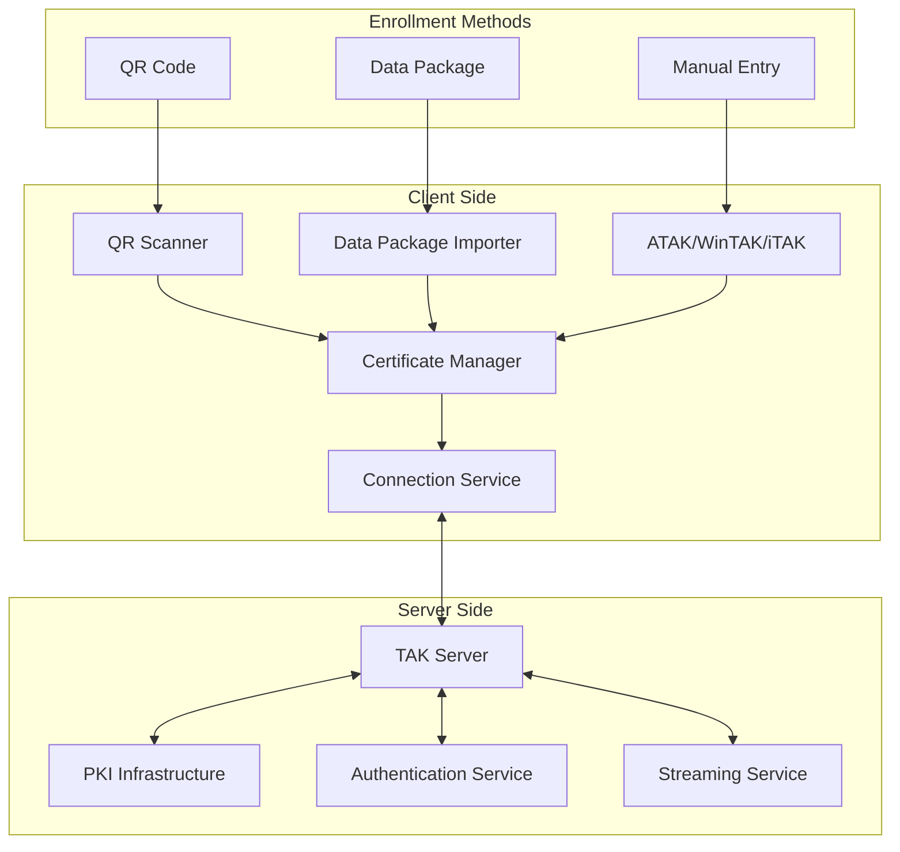
```mermaid
graph TB
    subgraph "Client Side"
        ATAK[ATAK/WinTAK/iTAK]
        QR[QR Scanner]
        DP[Data Package Importer]
        CM[Certificate Manager]
        CS[Connection Service]
    end
    
    subgraph "Server Side"
        TS[TAK Server]
        PKI[PKI Infrastructure]
        AUTH[Authentication Service]
        STREAM[Streaming Service]
    end
    
    subgraph "Enrollment Methods"
        QRC[QR Code]
        DPK[Data Package]
        MAN[Manual Entry]
    end
    
    QRC --> QR
    DPK --> DP
    MAN --> ATAK
    
    QR --> CM
    DP --> CM
    ATAK --> CM
    
    CM --> CS
    CS <--> TS
    TS <--> PKI
    TS <--> AUTH
    TS <--> STREAM
```

### Data Flow Architecture

The TAK enrollment process involves multiple data flows depending on the enrollment method:

1. **URL Processing Flow**: `Intent → ATAKActivity → Broadcast → Component Handlers`
2. **Certificate Flow**: `Import → Validation → Storage → Authentication`
3. **Connection Flow**: `Configuration → Handshake → Stream Establishment`

---

## Certificate Hierarchy and Trust Chains

### PKI Structure

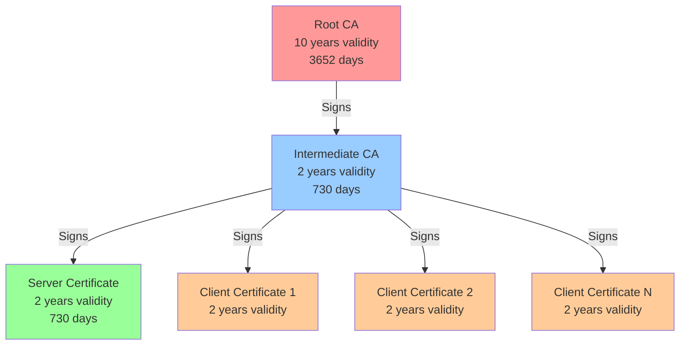
```mermaid
graph TD
    ROOT[Root CA<br/>10 years validity<br/>3652 days]
    INT[Intermediate CA<br/>2 years validity<br/>730 days]
    SERVER[Server Certificate<br/>2 years validity<br/>730 days]
    CLIENT1[Client Certificate 1<br/>2 years validity]
    CLIENT2[Client Certificate 2<br/>2 years validity]
    CLIENT3[Client Certificate N<br/>2 years validity]
    
    ROOT -->|Signs| INT
    INT -->|Signs| SERVER
    INT -->|Signs| CLIENT1
    INT -->|Signs| CLIENT2
    INT -->|Signs| CLIENT3
    
    style ROOT fill:#ff9999
    style INT fill:#99ccff
    style SERVER fill:#99ff99
    style CLIENT1 fill:#ffcc99
    style CLIENT2 fill:#ffcc99
    style CLIENT3 fill:#ffcc99
```

### Certificate Generation Process

#### 1. Root Certificate Authority
```bash
# TAK Server command sequence
cd /opt/tak/certs
./makeRootCa.sh
# Creates: ca.pem, ca-do-not-share.key
# Validity: 3652 days (10 years)
```

#### 2. Intermediate Certificate Authority
```bash
./makeCert.sh ca intermediate-ca
# Creates: intermediate-ca.pem, intermediate-ca.key
# Signed by: Root CA
# Validity: 730 days (2 years)
```

#### 3. Server Certificate
```bash
./makeCert.sh server takserver
# Creates: takserver.pem, takserver.key
# Signed by: Intermediate CA
# Validity: 730 days
```

#### 4. Client Certificates
```bash
./makeCert.sh client username
# Creates: username.p12 (PKCS#12 bundle)
# Contains: Client cert + private key
# Password protected
```

### Trust Chain Validation

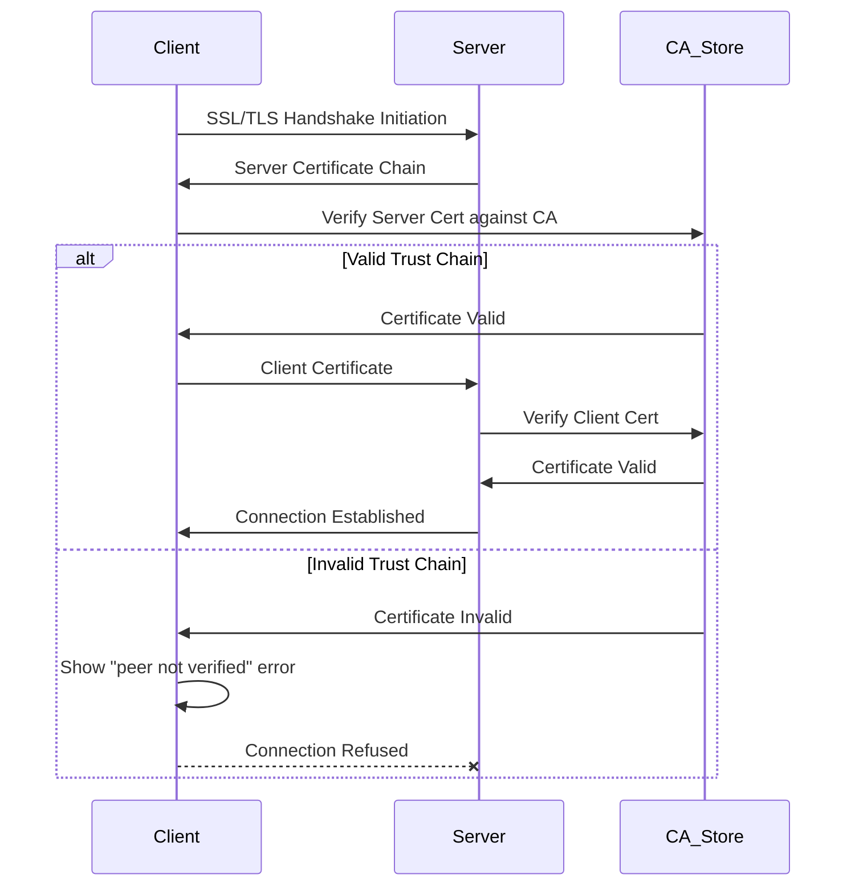
```mermaid
sequenceDiagram
    participant Client
    participant Server
    participant CA_Store
    
    Client->>Server: SSL/TLS Handshake Initiation
    Server->>Client: Server Certificate Chain
    Client->>CA_Store: Verify Server Cert against CA
    
    alt Valid Trust Chain
        CA_Store->>Client: Certificate Valid
        Client->>Server: Client Certificate
        Server->>CA_Store: Verify Client Cert
        CA_Store->>Server: Certificate Valid
        Server->>Client: Connection Established
    else Invalid Trust Chain
        CA_Store->>Client: Certificate Invalid
        Client->>Client: Show "peer not verified" error
        Client--xServer: Connection Refused
    end
```

### Certificate Types and Storage

#### ATAK Certificate Database Structure

| Certificate Type | Storage Key | Purpose | Format |
|-----------------|------------|---------|--------|
| `TRUST_STORE_CA` | Server-specific or default | CA certificate for trust validation | PKCS#12 |
| `CLIENT_CERTIFICATE` | Server-specific | Client authentication certificate | PKCS#12 |
| `UPDATE_SERVER_TRUST_STORE_CA` | Update server | Software update server CA | PKCS#12 |

#### Certificate Password Management

```java
// From AtakCertificateDatabaseBase.java
AtakCertificateDatabaseBase.saveCertificatePassword(
    password,
    ICredentialsStore.Credentials.TYPE_caPassword,  // or TYPE_clientPassword
    connectString
);
```

---

## Enrollment Methods

### Method Comparison Matrix

| Feature | QR Code | Data Package | Manual Entry |
|---------|---------|--------------|--------------|
| **Port Specification** | ❌ (8089 only) | ✅ (Any port) | ✅ (Any port) |
| **Protocol Selection** | ❌ (SSL only) | ✅ (TCP/SSL/QUIC) | ✅ (All protocols) |
| **Certificate Bundle** | ❌ | ✅ | ❌ |
| **Bulk Configuration** | ❌ | ✅ | ❌ |
| **User Interaction** | Minimal | Minimal | Extensive |
| **Security Level** | Medium | High | Variable |
| **Offline Support** | ❌ | ✅ | ✅ |
| **Multi-Server Config** | ❌ | ✅ | ❌ |

### 1. QR Code Enrollment

#### URL Format
```
tak://com.atakmap.app/enroll?host=<server>&username=<user>&token=<password>
```

#### Processing Flow
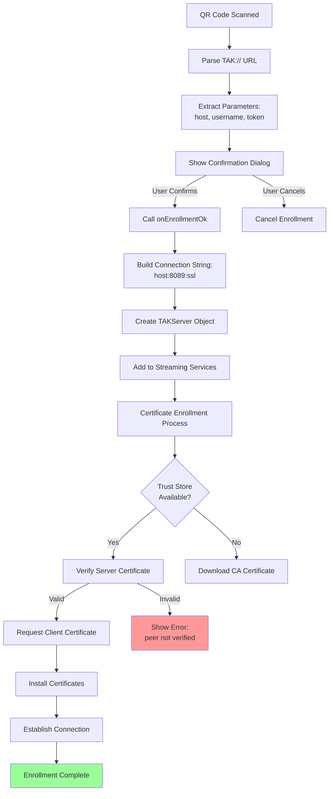
```mermaid
flowchart TD
    START[QR Code Scanned]
    PARSE[Parse TAK:// URL]
    EXTRACT[Extract Parameters:<br/>host, username, token]
    DIALOG[Show Confirmation Dialog]
    
    PARSE --> EXTRACT
    START --> PARSE
    EXTRACT --> DIALOG
    
    DIALOG -->|User Confirms| ENROLL[Call onEnrollmentOk]
    DIALOG -->|User Cancels| END[Cancel Enrollment]
    
    ENROLL --> BUILD[Build Connection String:<br/>host:8089:ssl]
    BUILD --> CREATE[Create TAKServer Object]
    CREATE --> ADD[Add to Streaming Services]
    ADD --> CERT[Certificate Enrollment Process]
    
    CERT --> CHECK_TRUST{Trust Store<br/>Available?}
    CHECK_TRUST -->|Yes| VERIFY[Verify Server Certificate]
    CHECK_TRUST -->|No| DOWNLOAD[Download CA Certificate]
    
    VERIFY -->|Valid| REQUEST[Request Client Certificate]
    VERIFY -->|Invalid| ERROR[Show Error:<br/>peer not verified]
    
    REQUEST --> INSTALL[Install Certificates]
    INSTALL --> CONNECT[Establish Connection]
    CONNECT --> SUCCESS[Enrollment Complete]
    
    style ERROR fill:#ff9999
    style SUCCESS fill:#99ff99
```

#### Code Implementation
```java
// From CotMapComponent.java (ATAK 5.5.0.0)
if ("com.atakmap.app/enroll".equals(u.getHost() + u.getPath())) {
    final String host = u.getQueryParameter("host");
    final String username = u.getQueryParameter("username");
    final String token = u.getQueryParameter("token");
    
    // LIMITATION: No port or protocol parameters extracted
    // Always defaults to 8089:ssl
    
    CertificateEnrollmentClient.getInstance().onEnrollmentOk(
        context, host, "", host, username, token, -1L);
}
```

### 2. Data Package Import

#### Package Structure
```
datapackage.zip/
├── MANIFEST/
│   └── manifest.xml              # Package metadata
├── certs/                        # Certificates directory
│   ├── truststore-ca.p12        # CA certificate
│   └── client-cert.p12          # Client certificate
├── prefs/                        # Preferences directory
│   └── config.pref              # Connection configuration
└── files/                        # Additional content
    └── [maps, overlays, etc.]   # Optional resources
```

#### Manifest XML Structure
```xml
<?xml version="1.0" encoding="UTF-8"?>
<MissionPackageManifest version="2">
    <Configuration>
        <Parameter name="uid" value="unique-package-id"/>
        <Parameter name="name" value="TAK Server Configuration"/>
        <Parameter name="onReceiveDelete" value="true"/>
        <Parameter name="onReceiveImport" value="true"/>
    </Configuration>
    <Contents>
        <Content ignore="false" zipEntry="prefs/config.pref"/>
        <Content ignore="false" zipEntry="certs/truststore-ca.p12"/>
        <Content ignore="false" zipEntry="certs/client-cert.p12"/>
    </Contents>
</MissionPackageManifest>
```

#### Configuration Properties (config.pref)
```properties
# Connection configuration - supports QUIC!
connectString0=server.example.com:8090:quic
description0=Primary QUIC Server
enabled0=true
useAuth0=true
username0=takuser
cacheCreds0=true
compress0=false

# Certificate configuration
caLocation=certs/truststore-ca.p12
caPassword=ChangeMe123!
certificateLocation=certs/client-cert.p12
clientPassword=ClientPass456!

# Enrollment settings
enrollForCertificateWithTrust=false
enrollUseTrust=true
expiration=-1

# Multiple server support
connectString1=backup.server.com:8089:ssl
description1=Backup SSL Server
enabled1=true
```

#### Import Processing Flow
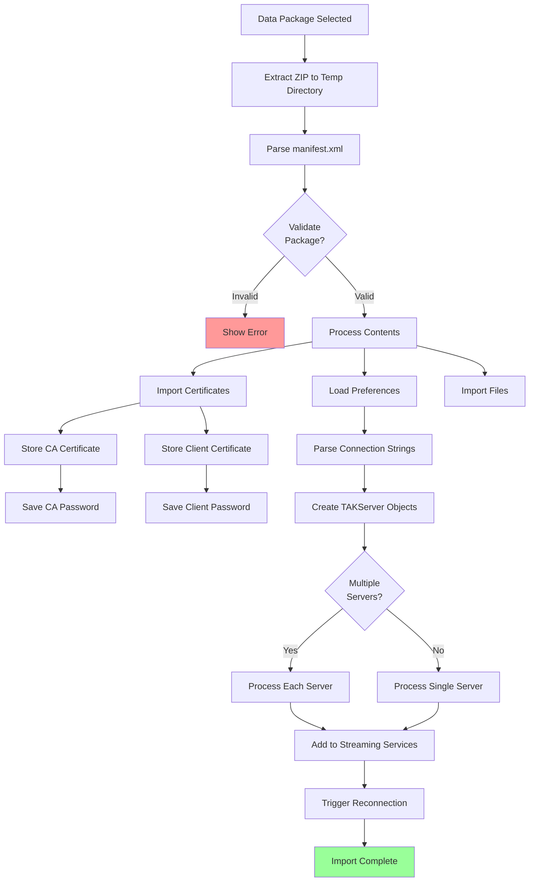
```mermaid
flowchart TD
    START[Data Package Selected]
    EXTRACT[Extract ZIP to Temp Directory]
    MANIFEST[Parse manifest.xml]
    
    START --> EXTRACT
    EXTRACT --> MANIFEST
    
    MANIFEST --> VALIDATE{Validate<br/>Package?}
    VALIDATE -->|Invalid| ERROR[Show Error]
    VALIDATE -->|Valid| PROCESS[Process Contents]
    
    PROCESS --> CERTS[Import Certificates]
    PROCESS --> PREFS[Load Preferences]
    PROCESS --> FILES[Import Files]
    
    CERTS --> STORE_CA[Store CA Certificate]
    CERTS --> STORE_CLIENT[Store Client Certificate]
    
    STORE_CA --> PWD_CA[Save CA Password]
    STORE_CLIENT --> PWD_CLIENT[Save Client Password]
    
    PREFS --> PARSE_CONN[Parse Connection Strings]
    PARSE_CONN --> CREATE_SERVERS[Create TAKServer Objects]
    
    CREATE_SERVERS --> MULTI{Multiple<br/>Servers?}
    MULTI -->|Yes| LOOP[Process Each Server]
    MULTI -->|No| SINGLE[Process Single Server]
    
    LOOP --> ADD_STREAM[Add to Streaming Services]
    SINGLE --> ADD_STREAM
    
    ADD_STREAM --> RECONNECT[Trigger Reconnection]
    RECONNECT --> SUCCESS[Import Complete]
    
    style ERROR fill:#ff9999
    style SUCCESS fill:#99ff99
```

### 3. Manual Configuration

Manual configuration involves direct entry through the ATAK UI:

1. **Server Settings**
   - Host/IP address
   - Port number (any valid port)
   - Protocol selection (TCP/SSL/QUIC)

2. **Authentication**
   - Username and password
   - Certificate selection
   - Trust store configuration

3. **Advanced Options**
   - Compression settings
   - Timeout values
   - Retry policies

---

## Protocol and Port Configuration

### Standard Port Assignments

| Port | Protocol | Purpose | Security Level |
|------|----------|---------|----------------|
| **8087** | TCP/UDP | Plain text communication | None |
| **8088** | STCP | Streaming TCP | None |
| **8089** | SSL/TLS | Default secure connection | High |
| **8090** | QUIC/TLS | QUIC protocol communication | Very High |
| **8443** | HTTPS | Web interface | High |
| **8446** | HTTPS | Certificate enrollment | High |

### Protocol Support Matrix

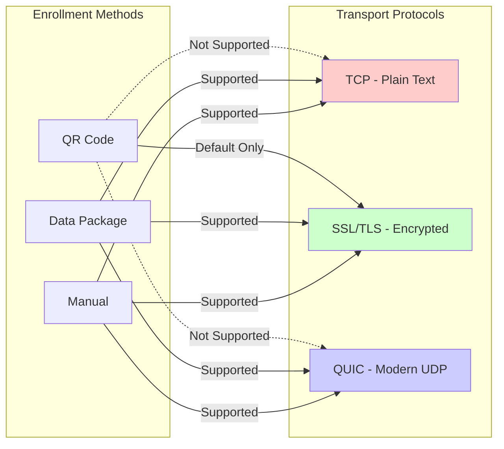
```mermaid
graph LR
    subgraph "Transport Protocols"
        TCP[TCP - Plain Text]
        SSL[SSL/TLS - Encrypted]
        QUIC[QUIC - Modern UDP]
    end
    
    subgraph "Enrollment Methods"
        QR[QR Code]
        DP[Data Package]
        MAN[Manual]
    end
    
    QR -.->|Not Supported| TCP
    QR -->|Default Only| SSL
    QR -.->|Not Supported| QUIC
    
    DP -->|Supported| TCP
    DP -->|Supported| SSL
    DP -->|Supported| QUIC
    
    MAN -->|Supported| TCP
    MAN -->|Supported| SSL
    MAN -->|Supported| QUIC
    
    style TCP fill:#ffcccc
    style SSL fill:#ccffcc
    style QUIC fill:#ccccff
```

### Protocol Implementation Details

#### StreamingTransport Enum (CommonCommo)
```java
public enum StreamingTransport {
    TCP(0),    // Native value: 0
    SSL(1),    // Native value: 1
    QUIC(2);   // Native value: 2
    
    private final int transport;
    
    int getNativeVal() {
        return this.transport;
    }
}
```

#### Protocol String Mapping
```java
// NetConnectString.java processing
String proto = parts[2].toLowerCase();
switch(proto) {
    case "tcp":
        transport = StreamingTransport.TCP;
        break;
    case "ssl":
    case "tls":
        transport = StreamingTransport.SSL;
        break;
    case "quic":
        transport = StreamingTransport.QUIC;
        break;
}
```

---

## Connection String Processing

### Format Specification

```
host:port:protocol[:callsign]
```

### Parsing Logic

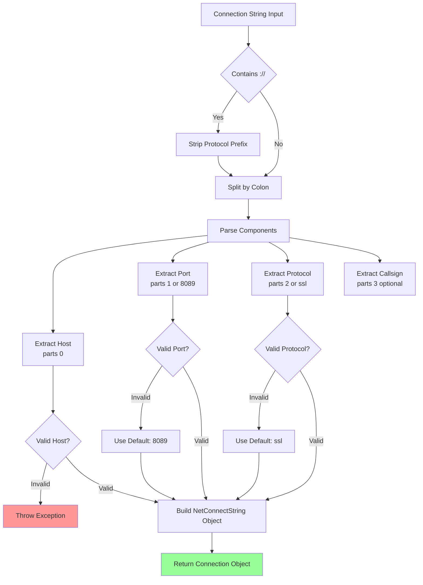
```mermaid
flowchart TD
    INPUT[Connection String Input]
    CHECK_PROTOCOL{Contains ://}
    
    INPUT --> CHECK_PROTOCOL
    
    CHECK_PROTOCOL -->|Yes| STRIP[Strip Protocol Prefix]
    CHECK_PROTOCOL -->|No| SPLIT[Split by Colon]
    
    STRIP --> SPLIT
    
    SPLIT --> PARSE[Parse Components]
    
    PARSE --> HOST[Extract Host<br/>parts 0]
    PARSE --> PORT[Extract Port<br/>parts 1 or 8089]
    PARSE --> PROTO[Extract Protocol<br/>parts 2 or ssl]
    PARSE --> CALL[Extract Callsign<br/>parts 3 optional]
    
    HOST --> VALIDATE_HOST{Valid Host?}
    PORT --> VALIDATE_PORT{Valid Port?}
    PROTO --> VALIDATE_PROTO{Valid Protocol?}
    
    VALIDATE_HOST -->|Invalid| ERROR[Throw Exception]
    VALIDATE_PORT -->|Invalid| DEFAULT_PORT[Use Default: 8089]
    VALIDATE_PROTO -->|Invalid| DEFAULT_PROTO[Use Default: ssl]
    
    VALIDATE_HOST -->|Valid| BUILD
    DEFAULT_PORT --> BUILD
    DEFAULT_PROTO --> BUILD
    VALIDATE_PORT -->|Valid| BUILD
    VALIDATE_PROTO -->|Valid| BUILD
    
    BUILD[Build NetConnectString Object]
    BUILD --> RETURN[Return Connection Object]
    
    style ERROR fill:#ff9999
    style RETURN fill:#99ff99
```

### Implementation Examples

```java
// From NetConnectString.java
public static NetConnectString fromString(String connectString) {
    // Handle various formats:
    // "host:port:protocol" - standard format
    // "host:port" - protocol defaults to null
    // "protocol://host:port" - URL-style format
    
    String[] parts = connectString.split(":");
    
    if (parts[0] == null || parts[0].equals("")) {
        // ":port" format - binds to all interfaces
        host = "0.0.0.0";
        port = Integer.parseInt(parts[1]);
    } else if (parts[1].contains("//")) {
        // "protocol://host:port" format
        proto = parts[0];
        host = parts[1].replace("/", "");
        port = Integer.parseInt(parts[2]);
    } else {
        // "host:port:protocol" standard format
        host = parts[0];
        port = Integer.parseInt(parts[1]);
        proto = parts[2].toLowerCase();
    }
}
```

---

## QR Code Enrollment Flow

### Detailed Sequence Diagram

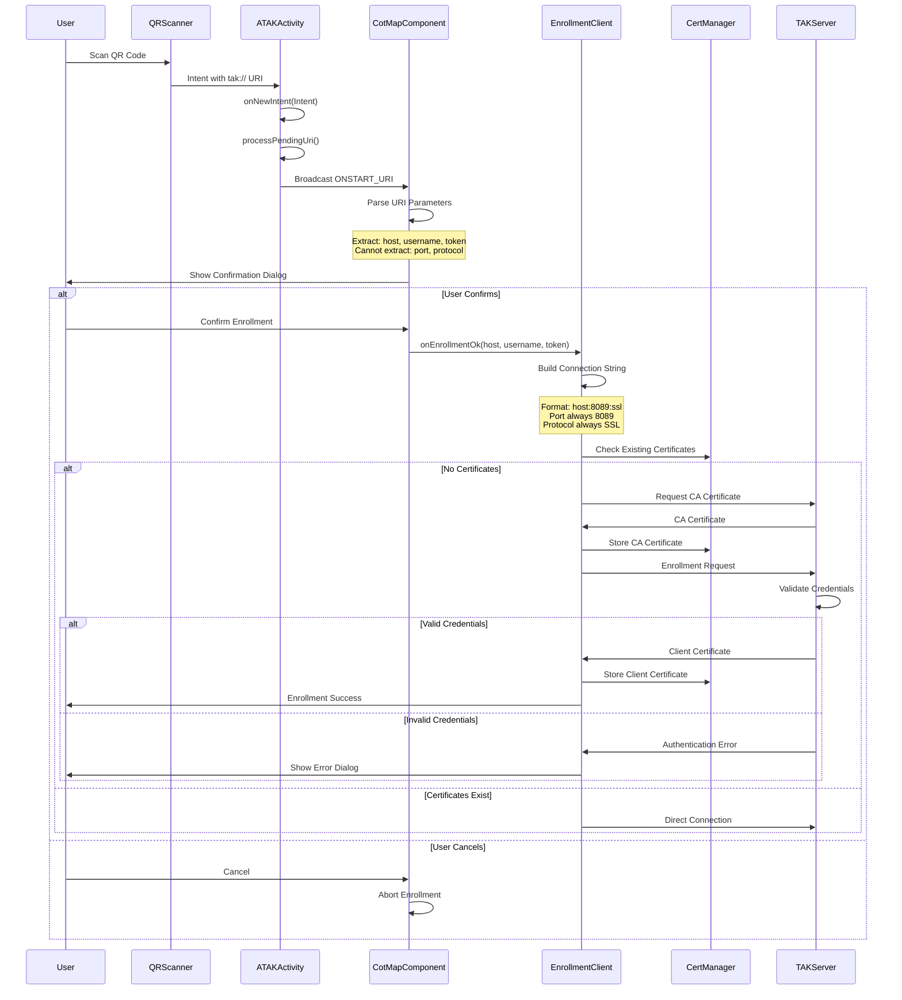
```mermaid
sequenceDiagram
    participant User
    participant QRScanner
    participant ATAKActivity
    participant CotMapComponent
    participant EnrollmentClient
    participant CertManager
    participant TAKServer
    
    User->>QRScanner: Scan QR Code
    QRScanner->>ATAKActivity: Intent with tak:// URI
    ATAKActivity->>ATAKActivity: onNewIntent(Intent)
    ATAKActivity->>ATAKActivity: processPendingUri()
    ATAKActivity->>CotMapComponent: Broadcast ONSTART_URI
    
    CotMapComponent->>CotMapComponent: Parse URI Parameters
    Note over CotMapComponent: Extract: host, username, token<br/>Cannot extract: port, protocol
    
    CotMapComponent->>User: Show Confirmation Dialog
    
    alt User Confirms
        User->>CotMapComponent: Confirm Enrollment
        CotMapComponent->>EnrollmentClient: onEnrollmentOk(host, username, token)
        
        EnrollmentClient->>EnrollmentClient: Build Connection String
        Note over EnrollmentClient: Format: host:8089:ssl<br/>Port always 8089<br/>Protocol always SSL
        
        EnrollmentClient->>CertManager: Check Existing Certificates
        
        alt No Certificates
            EnrollmentClient->>TAKServer: Request CA Certificate
            TAKServer->>EnrollmentClient: CA Certificate
            EnrollmentClient->>CertManager: Store CA Certificate
            
            EnrollmentClient->>TAKServer: Enrollment Request
            TAKServer->>TAKServer: Validate Credentials
            
            alt Valid Credentials
                TAKServer->>EnrollmentClient: Client Certificate
                EnrollmentClient->>CertManager: Store Client Certificate
                EnrollmentClient->>User: Enrollment Success
            else Invalid Credentials
                TAKServer->>EnrollmentClient: Authentication Error
                EnrollmentClient->>User: Show Error Dialog
            end
        else Certificates Exist
            EnrollmentClient->>TAKServer: Direct Connection
        end
    else User Cancels
        User->>CotMapComponent: Cancel
        CotMapComponent->>CotMapComponent: Abort Enrollment
    end
```

### State Machine

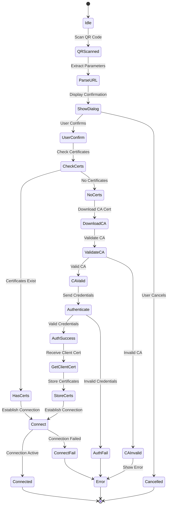
```mermaid
stateDiagram-v2
    [*] --> Idle
    Idle --> QRScanned: Scan QR Code
    
    QRScanned --> ParseURL: Extract Parameters
    ParseURL --> ShowDialog: Display Confirmation
    
    ShowDialog --> UserConfirm: User Confirms
    ShowDialog --> Cancelled: User Cancels
    
    UserConfirm --> CheckCerts: Check Certificates
    
    CheckCerts --> HasCerts: Certificates Exist
    CheckCerts --> NoCerts: No Certificates
    
    NoCerts --> DownloadCA: Download CA Cert
    DownloadCA --> ValidateCA: Validate CA
    
    ValidateCA --> CAValid: Valid CA
    ValidateCA --> CAInvalid: Invalid CA
    
    CAValid --> Authenticate: Send Credentials
    CAInvalid --> Error: Show Error
    
    Authenticate --> AuthSuccess: Valid Credentials
    Authenticate --> AuthFail: Invalid Credentials
    
    AuthSuccess --> GetClientCert: Receive Client Cert
    GetClientCert --> StoreCerts: Store Certificates
    StoreCerts --> Connect: Establish Connection
    
    HasCerts --> Connect: Establish Connection
    
    Connect --> Connected: Connection Active
    Connect --> ConnectFail: Connection Failed
    
    Connected --> [*]
    ConnectFail --> Error
    AuthFail --> Error
    Error --> [*]
    Cancelled --> [*]
```

---

## Data Package Import Flow

### Complete Import Sequence

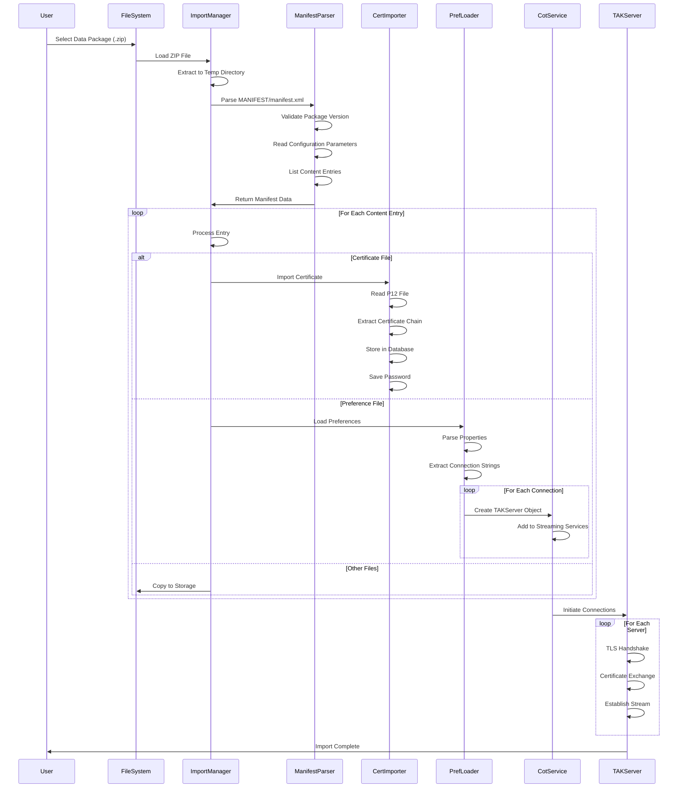
```mermaid
sequenceDiagram
    participant User
    participant FileSystem
    participant ImportManager
    participant ManifestParser
    participant CertImporter
    participant PrefLoader
    participant CotService
    participant TAKServer
    
    User->>FileSystem: Select Data Package (.zip)
    FileSystem->>ImportManager: Load ZIP File
    
    ImportManager->>ImportManager: Extract to Temp Directory
    ImportManager->>ManifestParser: Parse MANIFEST/manifest.xml
    
    ManifestParser->>ManifestParser: Validate Package Version
    ManifestParser->>ManifestParser: Read Configuration Parameters
    ManifestParser->>ManifestParser: List Content Entries
    
    ManifestParser->>ImportManager: Return Manifest Data
    
    loop For Each Content Entry
        ImportManager->>ImportManager: Process Entry
        
        alt Certificate File
            ImportManager->>CertImporter: Import Certificate
            CertImporter->>CertImporter: Read P12 File
            CertImporter->>CertImporter: Extract Certificate Chain
            CertImporter->>CertImporter: Store in Database
            CertImporter->>CertImporter: Save Password
        else Preference File
            ImportManager->>PrefLoader: Load Preferences
            PrefLoader->>PrefLoader: Parse Properties
            PrefLoader->>PrefLoader: Extract Connection Strings
            
            loop For Each Connection
                PrefLoader->>CotService: Create TAKServer Object
                CotService->>CotService: Add to Streaming Services
            end
        else Other Files
            ImportManager->>FileSystem: Copy to Storage
        end
    end
    
    CotService->>TAKServer: Initiate Connections
    
    loop For Each Server
        TAKServer->>TAKServer: TLS Handshake
        TAKServer->>TAKServer: Certificate Exchange
        TAKServer->>TAKServer: Establish Stream
    end
    
    TAKServer->>User: Import Complete
```

### Certificate Import Details

```java
// From ImportCertSort.java
private boolean importCertificatesFromProperties(Properties properties, ...) {
    // Import CA certificate
    String caLocation = properties.getProperty("caLocation");
    if (AtakCertificateDatabaseBase.importCertificate(
            caLocation, connectString, "TRUST_STORE_CA", true) != null) {
        String caPassword = properties.getProperty("caPassword");
        if (caPassword != null) {
            AtakCertificateDatabaseBase.saveCertificatePassword(
                caPassword, TYPE_caPassword, connectString);
        }
    }
    
    // Import client certificate
    String clientLocation = properties.getProperty("certificateLocation");
    if (AtakCertificateDatabaseBase.importCertificate(
            clientLocation, connectString, "CLIENT_CERTIFICATE", true) != null) {
        String clientPassword = properties.getProperty("clientPassword");
        if (clientPassword != null) {
            AtakCertificateDatabaseBase.saveCertificatePassword(
                clientPassword, TYPE_clientPassword, connectString);
        }
    }
}
```

---

## Certificate Validation Process

### TLS Handshake and Certificate Verification

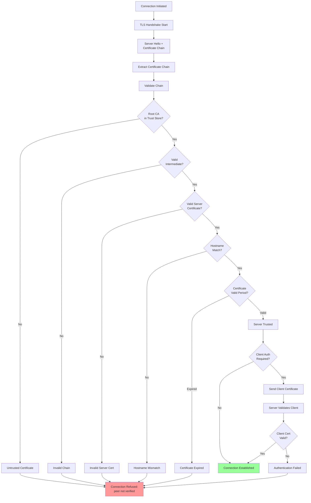
```mermaid
flowchart TD
    START[Connection Initiated]
    HANDSHAKE[TLS Handshake Start]
    
    START --> HANDSHAKE
    
    HANDSHAKE --> SERVER_HELLO[Server Hello +<br/>Certificate Chain]
    
    SERVER_HELLO --> EXTRACT_CHAIN[Extract Certificate Chain]
    
    EXTRACT_CHAIN --> VALIDATE_CHAIN[Validate Chain]
    
    VALIDATE_CHAIN --> CHECK_ROOT{Root CA<br/>in Trust Store?}
    
    CHECK_ROOT -->|No| UNTRUSTED[Untrusted Certificate]
    CHECK_ROOT -->|Yes| CHECK_INTERMEDIATE{Valid<br/>Intermediate?}
    
    CHECK_INTERMEDIATE -->|No| INVALID_CHAIN[Invalid Chain]
    CHECK_INTERMEDIATE -->|Yes| CHECK_SERVER{Valid Server<br/>Certificate?}
    
    CHECK_SERVER -->|No| INVALID_SERVER[Invalid Server Cert]
    CHECK_SERVER -->|Yes| CHECK_HOSTNAME{Hostname<br/>Match?}
    
    CHECK_HOSTNAME -->|No| HOSTNAME_MISMATCH[Hostname Mismatch]
    CHECK_HOSTNAME -->|Yes| CHECK_VALIDITY{Certificate<br/>Valid Period?}
    
    CHECK_VALIDITY -->|Expired| EXPIRED[Certificate Expired]
    CHECK_VALIDITY -->|Valid| SERVER_TRUSTED[Server Trusted]
    
    SERVER_TRUSTED --> CLIENT_AUTH{Client Auth<br/>Required?}
    
    CLIENT_AUTH -->|No| CONNECTED[Connection Established]
    CLIENT_AUTH -->|Yes| SEND_CLIENT_CERT[Send Client Certificate]
    
    SEND_CLIENT_CERT --> SERVER_VALIDATES[Server Validates Client]
    
    SERVER_VALIDATES --> CLIENT_VALID{Client Cert<br/>Valid?}
    
    CLIENT_VALID -->|Yes| CONNECTED
    CLIENT_VALID -->|No| AUTH_FAILED[Authentication Failed]
    
    UNTRUSTED --> ERROR[Connection Refused:<br/>peer not verified]
    INVALID_CHAIN --> ERROR
    INVALID_SERVER --> ERROR
    HOSTNAME_MISMATCH --> ERROR
    EXPIRED --> ERROR
    AUTH_FAILED --> ERROR
    
    style ERROR fill:#ff9999
    style CONNECTED fill:#99ff99
```

### Trust Store Management

```java
// From TLSUtils.java
public static TrustStore getTruststore(String server, boolean bUseDefault) {
    // 1. Try server-specific trust store
    byte[] data = AtakCertificateDatabaseBase.getCertificateForServer(
        "TRUST_STORE_CA", server);
    
    if (data != null && data.length > 0) {
        AtakAuthenticationCredentials caCertCredentials = 
            AtakAuthenticationDatabase.getCredentials(
                ICredentialsStore.Credentials.TYPE_caPassword, server);
        
        if (caCertCredentials != null && 
            !FileSystemUtils.isEmpty(caCertCredentials.password)) {
            return new TrustStore(data, caCertCredentials.password);
        }
    }
    
    // 2. Fall back to default trust store if requested
    if (bUseDefault) {
        return getDefaultTruststore(false);
    }
    
    return null;
}
```

### Self-Signed vs Trusted Certificates

| Aspect | Self-Signed | Trusted CA (Let's Encrypt, etc.) |
|--------|-------------|-----------------------------------|
| **Trust Validation** | Manual trust required | Automatic trust |
| **Initial Setup** | Certificate import needed | Works immediately |
| **Security Warning** | "peer not verified" | None |
| **Enrollment** | Requires CA distribution | Standard TLS |
| **Cost** | Free | Free to $$$ |
| **Management** | Complex rotation | Standard processes |
| **Client Experience** | Additional steps | Seamless |

---

## Connection Establishment Sequence

### Full Connection Flow

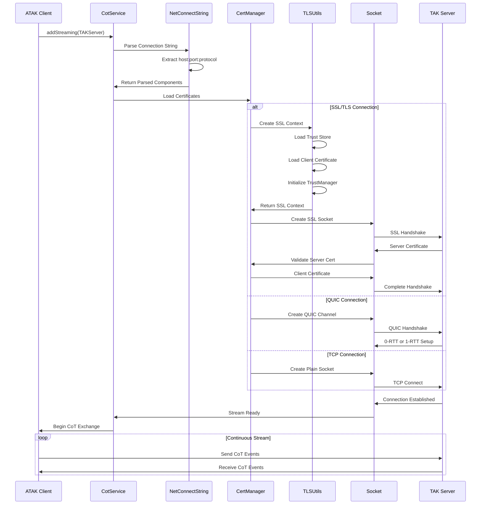
```mermaid
sequenceDiagram
    participant Client as ATAK Client
    participant CotService
    participant NetConnectString
    participant CertManager
    participant TLSUtils
    participant Socket
    participant Server as TAK Server
    
    Client->>CotService: addStreaming(TAKServer)
    CotService->>NetConnectString: Parse Connection String
    NetConnectString->>NetConnectString: Extract host:port:protocol
    
    NetConnectString->>CotService: Return Parsed Components
    
    CotService->>CertManager: Load Certificates
    
    alt SSL/TLS Connection
        CertManager->>TLSUtils: Create SSL Context
        TLSUtils->>TLSUtils: Load Trust Store
        TLSUtils->>TLSUtils: Load Client Certificate
        TLSUtils->>TLSUtils: Initialize TrustManager
        TLSUtils->>CertManager: Return SSL Context
        
        CertManager->>Socket: Create SSL Socket
        Socket->>Server: SSL Handshake
        
        Server->>Socket: Server Certificate
        Socket->>CertManager: Validate Server Cert
        
        CertManager->>Socket: Client Certificate
        Socket->>Server: Complete Handshake
        
    else QUIC Connection
        CertManager->>Socket: Create QUIC Channel
        Socket->>Server: QUIC Handshake
        Server->>Socket: 0-RTT or 1-RTT Setup
        
    else TCP Connection
        CertManager->>Socket: Create Plain Socket
        Socket->>Server: TCP Connect
    end
    
    Server->>Socket: Connection Established
    Socket->>CotService: Stream Ready
    
    CotService->>Client: Begin CoT Exchange
    
    loop Continuous Stream
        Client->>Server: Send CoT Events
        Server->>Client: Receive CoT Events
    end
```

### Connection State Machine

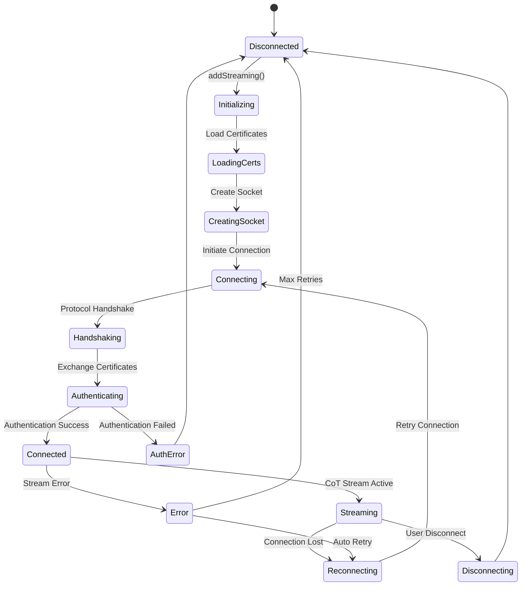
```mermaid
stateDiagram-v2
    [*] --> Disconnected
    
    Disconnected --> Initializing: addStreaming()
    
    Initializing --> LoadingCerts: Load Certificates
    LoadingCerts --> CreatingSocket: Create Socket
    
    CreatingSocket --> Connecting: Initiate Connection
    
    Connecting --> Handshaking: Protocol Handshake
    
    Handshaking --> Authenticating: Exchange Certificates
    
    Authenticating --> Connected: Authentication Success
    Authenticating --> AuthError: Authentication Failed
    
    Connected --> Streaming: CoT Stream Active
    
    Streaming --> Reconnecting: Connection Lost
    Reconnecting --> Connecting: Retry Connection
    
    Streaming --> Disconnecting: User Disconnect
    Disconnecting --> Disconnected
    
    AuthError --> Disconnected
    
    Connected --> Error: Stream Error
    Error --> Reconnecting: Auto Retry
    Error --> Disconnected: Max Retries
```

---

## Error Handling and Recovery

### Common Error Scenarios

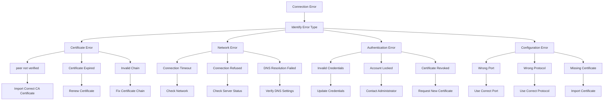
```mermaid
flowchart TD
    ERROR[Connection Error]
    
    ERROR --> IDENTIFY[Identify Error Type]
    
    IDENTIFY --> CERT_ERROR[Certificate Error]
    IDENTIFY --> NET_ERROR[Network Error]
    IDENTIFY --> AUTH_ERROR[Authentication Error]
    IDENTIFY --> CONFIG_ERROR[Configuration Error]
    
    CERT_ERROR --> PEER_NOT_VERIFIED[peer not verified]
    CERT_ERROR --> CERT_EXPIRED[Certificate Expired]
    CERT_ERROR --> CHAIN_INVALID[Invalid Chain]
    
    NET_ERROR --> TIMEOUT[Connection Timeout]
    NET_ERROR --> REFUSED[Connection Refused]
    NET_ERROR --> DNS_FAIL[DNS Resolution Failed]
    
    AUTH_ERROR --> BAD_CREDS[Invalid Credentials]
    AUTH_ERROR --> ACCOUNT_LOCKED[Account Locked]
    AUTH_ERROR --> CERT_REVOKED[Certificate Revoked]
    
    CONFIG_ERROR --> WRONG_PORT[Wrong Port]
    CONFIG_ERROR --> WRONG_PROTO[Wrong Protocol]
    CONFIG_ERROR --> MISSING_CERT[Missing Certificate]
    
    PEER_NOT_VERIFIED --> FIX_TRUST[Import Correct CA Certificate]
    CERT_EXPIRED --> RENEW_CERT[Renew Certificate]
    CHAIN_INVALID --> FIX_CHAIN[Fix Certificate Chain]
    
    TIMEOUT --> CHECK_NET[Check Network]
    REFUSED --> CHECK_SERVER[Check Server Status]
    DNS_FAIL --> CHECK_DNS[Verify DNS Settings]
    
    BAD_CREDS --> UPDATE_CREDS[Update Credentials]
    ACCOUNT_LOCKED --> CONTACT_ADMIN[Contact Administrator]
    CERT_REVOKED --> NEW_CERT[Request New Certificate]
    
    WRONG_PORT --> CORRECT_PORT[Use Correct Port]
    WRONG_PROTO --> CORRECT_PROTO[Use Correct Protocol]
    MISSING_CERT --> IMPORT_CERT[Import Certificate]
```

### Error Recovery Strategies

#### 1. Certificate Errors

```java
// Error: peer not verified
switch (error) {
    case PEER_NOT_VERIFIED:
        // Solution 1: Import correct CA certificate
        ImportCertSort.importCertificate(
            caPath, connectString, "TRUST_STORE_CA", true);
        
        // Solution 2: Re-enroll with correct trust store
        CertificateEnrollmentClient.enroll(
            context, desc, connectString, cacheCreds, 
            expiration, callback, getProfile, isQuickConnect);
        break;
        
    case CERTIFICATE_EXPIRED:
        // Request new certificate from server
        enrollForNewCertificate();
        break;
}
```

#### 2. Network Errors

```java
// Automatic retry with exponential backoff
int retryCount = 0;
int maxRetries = 5;
long backoffMs = 1000;

while (retryCount < maxRetries) {
    try {
        connect();
        break;
    } catch (NetworkException e) {
        retryCount++;
        Thread.sleep(backoffMs * Math.pow(2, retryCount));
    }
}
```

#### 3. Authentication Errors

```java
// Re-prompt for credentials
if (status == CertificateEnrollmentStatus.BAD_CREDENTIALS) {
    CredentialsDialog.createCredentialDialog(
        desc, connectString, username, "", 
        cacheCreds, expiration, context, callback);
}
```

---

## Security Considerations

### Security Architecture

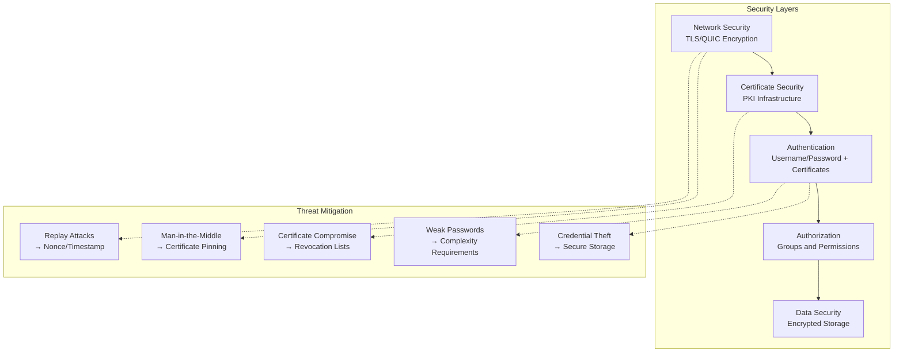
```mermaid
graph TB
    subgraph "Security Layers"
        L1[Network Security<br/>TLS/QUIC Encryption]
        L2[Certificate Security<br/>PKI Infrastructure]
        L3[Authentication<br/>Username/Password + Certificates]
        L4[Authorization<br/>Groups and Permissions]
        L5[Data Security<br/>Encrypted Storage]
    end
    
    L1 --> L2
    L2 --> L3
    L3 --> L4
    L4 --> L5
    
    subgraph "Threat Mitigation"
        T1[Man-in-the-Middle<br/>→ Certificate Pinning]
        T2[Credential Theft<br/>→ Secure Storage]
        T3[Replay Attacks<br/>→ Nonce/Timestamp]
        T4[Certificate Compromise<br/>→ Revocation Lists]
        T5[Weak Passwords<br/>→ Complexity Requirements]
    end
    
    L1 -.-> T1
    L2 -.-> T4
    L3 -.-> T2
    L3 -.-> T5
    L1 -.-> T3
```

### Security Best Practices

#### 1. Certificate Management

- **Use unique passwords** for each certificate
- **Rotate certificates** before expiration
- **Implement CRL** (Certificate Revocation Lists)
- **Use intermediate CAs** for easier rotation
- **Secure private keys** with hardware security modules

#### 2. Password Security

```bash
# Generate random certificate passwords
openssl rand -base64 16

# Example implementation from mytecknet.com
for cert in *.p12; do
    password=$(openssl rand -base64 16)
    # Change certificate password
    openssl pkcs12 -in "$cert" -out temp.pem -nodes -passin pass:oldpass
    openssl pkcs12 -export -in temp.pem -out "$cert" -passout pass:"$password"
    rm temp.pem
done
```

#### 3. Network Security

- **Use QUIC** when possible (port 8090)
- **Disable plain TCP** (port 8087) in production
- **Implement firewall rules** for TAK ports
- **Use VPN** for additional security layer
- **Monitor connection logs** for anomalies

#### 4. Enrollment Security

```java
// Secure enrollment recommendations
public class SecureEnrollment {
    // 1. Always verify server certificate
    private boolean verifyServerCertificate(X509Certificate cert) {
        // Check certificate chain
        // Verify hostname
        // Check validity period
        // Verify against pinned certificates
    }
    
    // 2. Use secure credential storage
    private void storeCredentials(String username, String password) {
        // Use Android Keystore
        // Encrypt with hardware-backed keys
        // Never store in plain text
    }
    
    // 3. Implement certificate pinning
    private boolean isPinnedCertificate(X509Certificate cert) {
        // Compare against known good certificates
        // Update pins through secure channel
    }
}
```

### Vulnerability Matrix

| Vulnerability | Impact | Mitigation |
|--------------|--------|------------|
| **Weak Certificate Passwords** | High | Random password generation |
| **Expired Certificates** | Medium | Automated rotation reminders |
| **Self-Signed CA Compromise** | Critical | HSM for CA private keys |
| **Clear Text Protocols** | High | Enforce SSL/QUIC only |
| **Credential Caching** | Medium | Secure storage with timeout |
| **Missing Certificate Validation** | Critical | Enforce chain validation |
| **DNS Spoofing** | High | Certificate pinning |
| **Replay Attacks** | Medium | Timestamp validation |

---

## Troubleshooting Guide

### Decision Tree for Common Issues

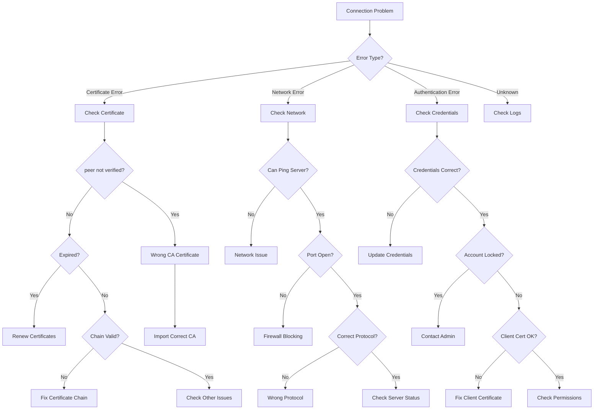
```mermaid
flowchart TD
    START[Connection Problem]
    
    START --> TYPE{Error Type?}
    
    TYPE -->|Certificate Error| CERT_CHECK[Check Certificate]
    TYPE -->|Network Error| NET_CHECK[Check Network]
    TYPE -->|Authentication Error| AUTH_CHECK[Check Credentials]
    TYPE -->|Unknown| LOGS[Check Logs]
    
    CERT_CHECK --> PEER_NOT{peer not verified?}
    PEER_NOT -->|Yes| WRONG_CA[Wrong CA Certificate]
    PEER_NOT -->|No| EXPIRED{Expired?}
    
    EXPIRED -->|Yes| RENEW[Renew Certificates]
    EXPIRED -->|No| CHAIN{Chain Valid?}
    
    CHAIN -->|No| FIX_CHAIN[Fix Certificate Chain]
    CHAIN -->|Yes| OTHER_CERT[Check Other Issues]
    
    WRONG_CA --> SOLUTION1[Import Correct CA]
    
    NET_CHECK --> PING{Can Ping Server?}
    PING -->|No| NETWORK[Network Issue]
    PING -->|Yes| PORT{Port Open?}
    
    PORT -->|No| FIREWALL[Firewall Blocking]
    PORT -->|Yes| PROTO{Correct Protocol?}
    
    PROTO -->|No| WRONG_PROTO[Wrong Protocol]
    PROTO -->|Yes| OTHER_NET[Check Server Status]
    
    AUTH_CHECK --> CREDS{Credentials Correct?}
    CREDS -->|No| UPDATE[Update Credentials]
    CREDS -->|Yes| LOCKED{Account Locked?}
    
    LOCKED -->|Yes| ADMIN[Contact Admin]
    LOCKED -->|No| CERT_AUTH{Client Cert OK?}
    
    CERT_AUTH -->|No| CLIENT_CERT[Fix Client Certificate]
    CERT_AUTH -->|Yes| OTHER_AUTH[Check Permissions]
```

### Diagnostic Commands

#### 1. Test Network Connectivity
```bash
# Test basic connectivity
ping tak-server.example.com

# Test port availability
nc -zv tak-server.example.com 8089
nc -zv tak-server.example.com 8090

# Test SSL connection
openssl s_client -connect tak-server.example.com:8089 \
    -CAfile ca-cert.pem

# Test with client certificate
openssl s_client -connect tak-server.example.com:8089 \
    -cert client.pem -key client.key -CAfile ca.pem
```

#### 2. Certificate Verification
```bash
# View certificate details
openssl pkcs12 -info -in client.p12

# Verify certificate chain
openssl verify -CAfile ca.pem -untrusted intermediate.pem server.pem

# Check certificate expiration
openssl x509 -enddate -noout -in cert.pem

# Extract certificates from P12
openssl pkcs12 -in bundle.p12 -out cert.pem -nodes
```

#### 3. TAK Server Diagnostics
```bash
# Check TAK Server status
systemctl status takserver

# View TAK Server logs
tail -f /opt/tak/logs/takserver.log

# Check certificate configuration
cat /opt/tak/CoreConfig.xml | grep -A5 "tls"

# List active connections
netstat -an | grep -E ":(8089|8090)"
```

### Common Error Messages and Solutions

| Error Message | Cause | Solution |
|--------------|-------|----------|
| **"peer not verified"** | Wrong or missing CA certificate | Import correct truststore-ca.p12 |
| **"Connection refused"** | Server not running or wrong port | Check server status and port |
| **"Certificate expired"** | Certificate past validity period | Renew certificate |
| **"Bad credentials"** | Wrong username/password | Update credentials |
| **"SSL handshake failed"** | Protocol mismatch | Verify SSL/TLS version |
| **"No route to host"** | Network connectivity issue | Check network and firewall |
| **"Certificate revoked"** | Certificate on revocation list | Request new certificate |
| **"Hostname verification failed"** | Certificate CN mismatch | Use correct server hostname |

---

## Best Practices

### Deployment Recommendations

#### 1. Certificate Architecture

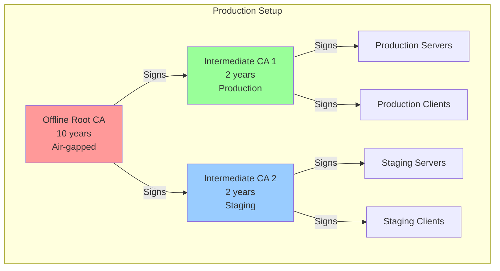
```mermaid
graph TD
    subgraph "Production Setup"
        ROOT[Offline Root CA<br/>10 years<br/>Air-gapped]
        INT1[Intermediate CA 1<br/>2 years<br/>Production]
        INT2[Intermediate CA 2<br/>2 years<br/>Staging]
        
        ROOT -->|Signs| INT1
        ROOT -->|Signs| INT2
        
        INT1 -->|Signs| PROD_SERVER[Production Servers]
        INT1 -->|Signs| PROD_CLIENT[Production Clients]
        
        INT2 -->|Signs| STAGE_SERVER[Staging Servers]
        INT2 -->|Signs| STAGE_CLIENT[Staging Clients]
    end
    
    style ROOT fill:#ff9999
    style INT1 fill:#99ff99
    style INT2 fill:#99ccff
```

#### 2. Enrollment Strategy

**For Small Deployments (< 50 users)**
- Use data packages with pre-configured certificates
- Distribute via secure file transfer
- Include all server configurations

**For Medium Deployments (50-500 users)**
- Implement certificate enrollment server
- Use QR codes for initial enrollment
- Automate certificate renewal

**For Large Deployments (> 500 users)**
- Integrate with existing PKI infrastructure
- Use enterprise certificate management
- Implement automated provisioning

#### 3. Security Hardening

```bash
# TAK Server hardening checklist
□ Disable unnecessary ports (8087 for TCP)
□ Implement firewall rules
□ Use QUIC (8090) for enhanced security
□ Enable certificate revocation checking
□ Implement rate limiting
□ Enable audit logging
□ Regular certificate rotation
□ Secure backup of CA keys
□ Monitor for certificate expiration
□ Implement intrusion detection
```

#### 4. Monitoring and Maintenance

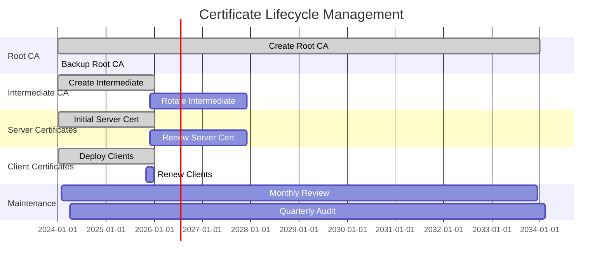
```mermaid
gantt
    title Certificate Lifecycle Management
    dateFormat  YYYY-MM-DD
    
    section Root CA
    Create Root CA           :done, root1, 2024-01-01, 3652d
    Backup Root CA           :done, 2024-01-02, 1d
    
    section Intermediate CA
    Create Intermediate      :done, int1, 2024-01-03, 730d
    Rotate Intermediate      :int2, 2025-12-01, 730d
    
    section Server Certificates
    Initial Server Cert      :done, srv1, 2024-01-04, 730d
    Renew Server Cert        :srv2, 2025-12-01, 730d
    
    section Client Certificates
    Deploy Clients           :done, cli1, 2024-01-05, 730d
    Renew Clients           :cli2, 2025-11-01, 60d
    
    section Maintenance
    Monthly Review          :review, 2024-02-01, 3600d
    Quarterly Audit         :audit, 2024-04-01, 3600d
```

---

## Technical Reference

### ATAK Source Code Components

| Component | File | Purpose |
|-----------|------|---------|
| **URL Handler** | `CotMapComponent.java` | Processes tak:// URLs |
| **Enrollment Client** | `CertificateEnrollmentClient.java` | Manages enrollment process |
| **Certificate Import** | `ImportCertSort.java` | Handles certificate imports |
| **Connection Management** | `TAKServer.java` | Server connection properties |
| **Network Strings** | `NetConnectString.java` | Connection string parsing |
| **TLS Utilities** | `TLSUtils.java` | SSL/TLS context creation |
| **Credentials** | `AtakAuthenticationDatabase.java` | Credential storage |
| **Certificates** | `AtakCertificateDatabaseBase.java` | Certificate database |

### TAK Server Components

| Component | Location | Purpose |
|-----------|----------|---------|
| **PKI Scripts** | `/opt/tak/certs/` | Certificate generation |
| **Core Config** | `/opt/tak/CoreConfig.xml` | Server configuration |
| **Connection Manager** | `BaseConnections.java` | Port definitions |
| **QUIC Server** | `QuicStreamingServer.java` | QUIC implementation |
| **Enrollment API** | Port 8446 | Certificate enrollment |

### Protocol Specifications

#### CoT (Cursor on Target) Protocol
- XML-based message format
- Real-time position and data sharing
- Supports multicast and unicast
- Extensible with custom attributes

#### QUIC Protocol Benefits
- 0-RTT connection resumption
- Multiplexed streams
- Built-in encryption (TLS 1.3)
- Better performance over lossy networks
- Reduced latency compared to TCP+TLS

---

## Appendices

### Appendix A: Sample Configurations

#### A.1 QR Code Generator Example
```javascript
// Generate enrollment QR code
function generateEnrollmentQR(host, username, password) {
    const url = `tak://com.atakmap.app/enroll?` +
                `host=${encodeURIComponent(host)}&` +
                `username=${encodeURIComponent(username)}&` +
                `token=${encodeURIComponent(password)}`;
    
    // Note: Cannot specify port or protocol
    // Will always use 8089:ssl
    
    return QRCode.toDataURL(url);
}
```

#### A.2 Data Package Configuration
```xml
<!-- config.pref for QUIC connection -->
<?xml version="1.0" encoding="UTF-8"?>
<preferences>
    <preference key="connectString0" value="tak.example.com:8090:quic"/>
    <preference key="description0" value="Primary QUIC Server"/>
    <preference key="enabled0" value="true"/>
    <preference key="useAuth0" value="true"/>
    <preference key="username0" value="takuser"/>
    <preference key="cacheCreds0" value="true"/>
    <preference key="caLocation" value="certs/truststore-ca.p12"/>
    <preference key="caPassword" value="SecurePassword123!"/>
    <preference key="certificateLocation" value="certs/client.p12"/>
    <preference key="clientPassword" value="ClientPass456!"/>
</preferences>
```

#### A.3 Certificate Generation Script
```bash
#!/bin/bash
# TAK Certificate Generation

# Set certificate metadata
cd /opt/tak/certs
./cert-metadata.sh

# Create Root CA (10 years)
./makeRootCa.sh --ca-name "TAK Root CA"

# Create Intermediate CA (2 years)
./makeCert.sh ca "TAK-Intermediate-CA"

# Create Server Certificate
./makeCert.sh server "takserver"

# Create Client Certificates
for user in user1 user2 user3; do
    ./makeCert.sh client "$user"
done

# Update server configuration
sed -i 's/CA_NAME/TAK-Intermediate-CA/g' ../CoreConfig.xml
```

### Appendix B: Error Code Reference

| Code | Error | Description | Resolution |
|------|-------|-------------|------------|
| E001 | PEER_NOT_VERIFIED | Server certificate not trusted | Import correct CA |
| E002 | CERT_EXPIRED | Certificate past validity | Renew certificate |
| E003 | HOSTNAME_MISMATCH | Certificate CN doesn't match | Use correct hostname |
| E004 | CHAIN_INCOMPLETE | Missing intermediate certificate | Include full chain |
| E005 | AUTH_FAILED | Authentication failure | Check credentials |
| E006 | CONN_REFUSED | Connection refused | Check server status |
| E007 | TIMEOUT | Connection timeout | Check network |
| E008 | PROTO_MISMATCH | Protocol mismatch | Use correct protocol |
| E009 | PORT_BLOCKED | Port blocked | Check firewall |
| E010 | CERT_REVOKED | Certificate revoked | Request new cert |

### Appendix C: Glossary

| Term | Definition |
|------|------------|
| **CA** | Certificate Authority - Entity that issues digital certificates |
| **CN** | Common Name - Primary domain name in certificate |
| **CoT** | Cursor on Target - TAK messaging protocol |
| **CRL** | Certificate Revocation List - List of revoked certificates |
| **CSR** | Certificate Signing Request - Request for certificate |
| **PKCS#12** | Personal Information Exchange - Certificate bundle format |
| **QUIC** | Quick UDP Internet Connections - Modern transport protocol |
| **SAN** | Subject Alternative Name - Additional certificate domains |
| **SSL/TLS** | Secure Sockets Layer/Transport Layer Security |
| **TAK** | Team Awareness Kit - Situational awareness platform |

### Appendix D: References

1. **ATAK Source Code** - Version 5.5.0.0 (commit: cdae3a1)
2. **TAK Server Documentation** - Official TAK documentation
3. **MyTeckNet TAK Guides** - https://mytecknet.com/tag/tak/
4. **RFC 9000** - QUIC: A UDP-Based Multiplexed and Secure Transport
5. **RFC 5280** - Internet X.509 Public Key Infrastructure
6. **Android Security Guidelines** - developer.android.com/security

---

## Conclusion

The TAK enrollment system represents a sophisticated balance between security and usability. While QR codes provide convenient enrollment, they are limited to basic SSL connections on port 8089. Data packages offer complete configurability including QUIC support but require more complex distribution. Understanding these trade-offs and the underlying certificate infrastructure is essential for successful TAK deployments.

Key takeaways:
1. **Plan certificate architecture** carefully with appropriate validity periods
2. **Use data packages** for production deployments requiring QUIC or custom ports
3. **Implement proper certificate rotation** before expiration
4. **Secure certificate passwords** with random generation
5. **Monitor and maintain** the enrollment infrastructure continuously

This guide serves as a comprehensive reference for implementing, troubleshooting, and maintaining TAK enrollment systems at any scale.

---

*Document Version: 1.0.0*  
*Last Updated: 2025-08-31*  
*Based on ATAK 5.5.0.0 and TAK Server 5.x*