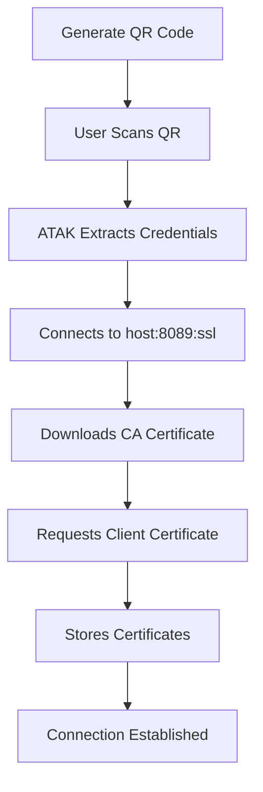
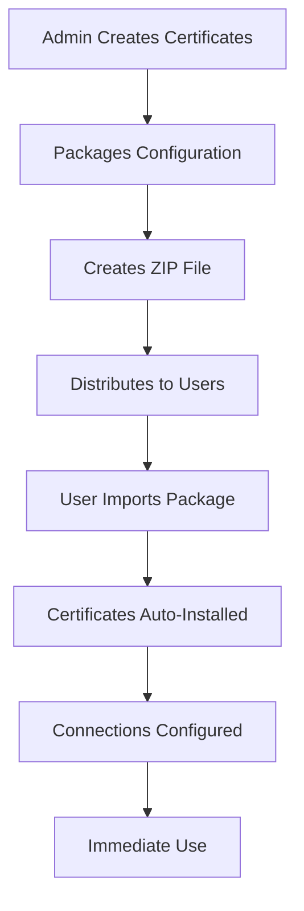
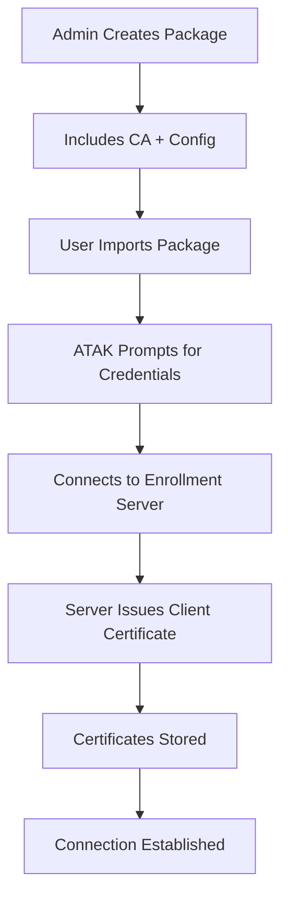
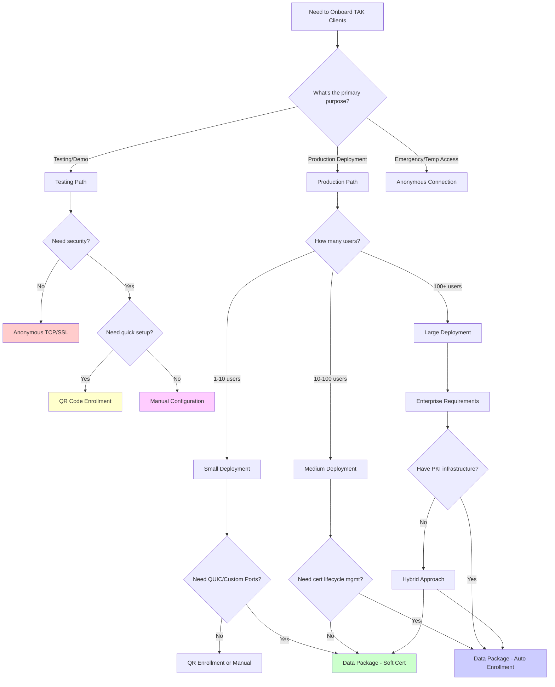

# TAK Onboarding Methods Explained: Complete Guide

## Table of Contents

1. [Executive Summary](#executive-summary)
2. [TAK Terminology Explained](#tak-terminology-explained)
3. [Onboarding Methods Overview](#onboarding-methods-overview)
4. [Method Comparison Matrix](#method-comparison-matrix)
5. [Detailed Method Explanations](#detailed-method-explanations)
6. [Decision Tree: Choosing the Right Method](#decision-tree-choosing-the-right-method)
7. [Real-World Scenarios](#real-world-scenarios)
8. [Security Implications](#security-implications)
9. [Technical Requirements](#technical-requirements)
10. [Troubleshooting Guide](#troubleshooting-guide)
11. [Best Practices](#best-practices)
12. [References](#references)

---

## Executive Summary

TAK (Team Awareness Kit) offers multiple methods for onboarding clients to servers, each with distinct advantages, limitations, and security implications. This guide provides a comprehensive explanation of all terminology and methods to help administrators choose the optimal approach for their deployment scenario.

### Quick Reference

| Method | Best For | Key Limitation | Security Level |
|--------|----------|----------------|----------------|
| **QR Code Enrollment** | Quick field deployment | SSL or QUIC only (no TCP) | Medium |
| **Data Package (Soft-Cert)** | Pre-configured clients | Manual cert distribution | High |
| **Data Package (Auto-Enroll)** | Enterprise deployment | Requires enrollment server | High |
| **Manual Configuration** | One-off setups | User complexity | Variable |
| **Anonymous Connection** | Testing/demos | No authentication | Low |

---

## TAK Terminology Explained

### Certificate Types

#### Soft Certificates vs Hard Certificates
- **Soft Certificates**: Digital certificates stored in software (files like .p12 or .pem)
  - Stored on device storage or secure keystores
  - Can be copied, backed up, and transferred
  - Used in most TAK deployments
  - Example: client-cert.p12 file containing user's identity

- **Hard Certificates**: Physical hardware-based certificates (smart cards, HSMs)
  - Stored on dedicated hardware devices
  - Cannot be extracted or copied
  - Rarely used in TAK deployments
  - Example: Common Access Card (CAC) or Personal Identity Verification (PIV) cards

#### Trust Store vs Client Certificates
- **Trust Store (CA Certificate)**: Contains Certificate Authority certificates used to verify server identity
  - File: truststore-ca.p12 or caCert.p12
  - Purpose: "Is this server legitimate?"
  - Required for all secure connections
  - Shared across multiple users

- **Client Certificate**: Contains user's digital identity for authentication
  - File: client-cert.p12 or clientCert.p12
  - Purpose: "Who is this user?"
  - Unique per user
  - Optional for some connection types

### Enrollment Methods

#### Auto-Enrollment vs Manual Enrollment
- **Auto-Enrollment**: Automated certificate issuance process
  - Client requests certificate from server using username/password
  - Server generates and returns client certificate automatically
  - Requires TAK Server enrollment endpoint (port 8446)
  - Configuration: `enrollForCertificateWithTrust=true`

- **Manual Enrollment**: Administrator pre-creates certificates
  - Certificates generated on server using command-line tools
  - Distributed to users via data packages or secure channels
  - No automated enrollment server required
  - Configuration: Pre-packaged client certificates

#### Certificate Enrollment vs Pre-Provisioned Certificates
- **Certificate Enrollment**: Dynamic certificate request process
  - Client connects to server with basic credentials
  - Server issues new certificate after authentication
  - Certificate tied to user account and permissions
  - Allows for certificate lifecycle management

- **Pre-Provisioned Certificates**: Static certificate distribution
  - Certificates created in advance by administrator
  - Distributed through secure channels (data packages, email)
  - No real-time server interaction for certificate issuance
  - Simpler but less flexible approach

### Connection Types

#### Anonymous vs Authenticated Connections
- **Anonymous Connections**: No user identification required
  - Uses plain TCP or SSL without client certificates
  - Server cannot identify individual users
  - Used for public feeds or demonstration environments
  - Security: Low (no user accountability)

- **Authenticated Connections**: Requires user identification
  - Uses client certificates or username/password
  - Server knows and tracks individual users
  - Enables user-based permissions and logging
  - Security: High (full user accountability)

---

## Onboarding Methods Overview

### 1. QR Code Enrollment
**What it is**: A QR code containing server credentials for automated enrollment

**Format**: `tak://com.atakmap.app/enroll?host=server.com&username=user&token=password`

**How it works**:
1. User scans QR code with ATAK/iTAK
2. App extracts server host, username, and password
3. The `host` parameter is parsed as a connect string (`host:port:protocol`):
   - Default: port 8089, SSL protocol
   - Custom port: `host=server.com:8090`
   - QUIC: `host=server.com:8090:quic`
4. Downloads CA certificate if needed
5. Requests client certificate using provided credentials
6. Stores certificates and establishes connection

Source: `CertificateEnrollmentClient.java:771-787` (ATAK CIV 5.5.0.0)

### 2. Data Package Import
**What it is**: A ZIP file containing complete configuration and certificates

**Types**:
- **Soft-Certificate Package**: Includes pre-made client certificates
- **Auto-Enrollment Package**: Includes only CA cert, triggers enrollment

**How it works**:
1. Administrator creates ZIP with configuration files
2. User imports ZIP file into TAK client
3. Client extracts and processes all contents
4. Certificates automatically installed
5. Connections configured and activated

### 3. Manual Configuration
**What it is**: Step-by-step configuration through TAK client interface

**Process**:
1. User enters server details manually
2. Imports certificates separately if needed
3. Configures authentication settings
4. Tests and saves connection

### 4. URL Import
**What it is**: QR code containing link to downloadable configuration

**Format**: `tak://com.atakmap.app/import?url=https%3A%2F%2Fserver.com%2Fconfig.zip`

**How it works**:
1. QR code contains URL to data package
2. Client downloads package from URL
3. Processes as normal data package import

### 5. Anonymous/Unauthenticated Access
**What it is**: Direct connection without certificates or credentials

**Use cases**:
- Public demonstration servers
- Testing environments
- Broadcast-only feeds
- Emergency situations

---

## Method Comparison Matrix

| Feature | QR Enrollment | Data Package (Soft-Cert) | Data Package (Auto-Enroll) | Manual Config | Anonymous |
|---------|---------------|---------------------------|----------------------------|---------------|-----------|
| **Setup Complexity** | Simple | Medium | Medium | Complex | Simple |
| **User Steps** | 1 (scan) | 1 (import) | 1 (import) + creds | Many | 1-3 |
| **Port Flexibility** | ❌ (8089 only) | ✅ (Any port) | ✅ (Any port) | ✅ (Any port) | ✅ (Any port) |
| **Protocol Support** | ❌ (SSL only) | ✅ (TCP/SSL/QUIC) | ✅ (TCP/SSL/QUIC) | ✅ (All) | ✅ (All) |
| **QUIC Support** | ❌ | ✅ | ✅ | ✅ | ✅ |
| **Bulk Deployment** | ❌ | ✅ | ✅ | ❌ | ✅ |
| **Certificate Management** | Server-generated | Pre-distributed | Server-generated | Manual | None |
| **Offline Support** | ❌ | ✅ | ❌ (needs enrollment) | ✅ | ✅ |
| **Security Level** | Medium | High | High | Variable | Low |
| **Credential Storage** | QR code (visible) | Package (encrypted) | User entry | User entry | None |
| **Multi-Server Config** | ❌ | ✅ | ✅ | ❌ | ❌ |
| **Enterprise Features** | ❌ | ✅ | ✅ | ❌ | ❌ |

---

## Detailed Method Explanations

### 1. QR Code Enrollment

#### When to Use
- Field deployment where speed is critical
- Users need immediate access to TAK server
- Standard SSL connection on port 8089 is sufficient
- You have an active enrollment server

#### Limitations
- **Fixed Port**: Always uses port 8089
- **Fixed Protocol**: Always uses SSL/TLS
- **No QUIC**: Cannot use modern QUIC protocol
- **Single Server**: Cannot configure multiple servers
- **Credential Visibility**: Username/password visible in QR code

#### Process Flow


#### Security Considerations
- Credentials are visible in QR code
- Susceptible to shoulder surfing
- Requires secure QR distribution
- Good for temporary or training accounts

### 2. Data Package (Soft-Certificate)

#### When to Use
- Maximum security required
- QUIC protocol needed (port 8090)
- Multiple server configurations
- Offline deployment scenarios
- Enterprise environments with PKI

#### What's Included
- **CA Certificate**: For server trust validation
- **Client Certificate**: Pre-generated user identity
- **Configuration**: Complete connection settings
- **Optional**: Maps, plugins, preferences

#### Process Flow


#### Advantages
- Complete offline configuration
- Support for all protocols (TCP, SSL, QUIC)
- Support for custom ports
- Multiple server configurations
- Enterprise-grade security

#### Disadvantages
- Requires certificate pre-generation
- Complex distribution process
- Fixed user identities
- Cannot change certificates without new package

### 3. Data Package (Auto-Enrollment)

#### When to Use
- Need certificate lifecycle management
- Want centralized user administration
- Require user accountability
- Have enrollment server capability

#### What's Included
- **CA Certificate**: For server trust validation
- **Configuration**: Connection settings with enrollment flags
- **No Client Certificate**: Generated during enrollment

#### Process Flow


#### Configuration Flags
- `enrollForCertificateWithTrust=true`: Enable auto-enrollment
- `useAuth=true`: Require authentication
- `cacheCreds=true`: Save credentials locally

### 4. Manual Configuration

#### When to Use
- One-off configurations
- Testing scenarios
- Advanced users
- Non-standard setups

#### Process
1. **Server Settings**: Enter hostname, port, protocol manually
2. **Certificate Import**: Separately import CA and client certificates
3. **Authentication**: Configure username/password or certificate auth
4. **Advanced Options**: Set compression, timeouts, etc.

#### Advantages
- Complete flexibility
- No additional files needed
- Can configure any combination of settings
- Good for troubleshooting

#### Disadvantages
- Time-consuming
- Error-prone
- Not suitable for bulk deployment
- Requires technical knowledge

### 5. Anonymous/Unauthenticated Connections

#### When to Use
- Public demonstration servers
- Broadcast-only scenarios (receive only)
- Testing environments
- Emergency/disaster response (temporary access)

#### Connection Types
- **Plain TCP**: Unencrypted connection (port 8087)
- **SSL without certificates**: Encrypted but no user identity
- **Public servers**: Open access servers

#### Security Impact
- No user identification or accountability
- All users appear as anonymous
- Cannot restrict access or permissions
- Suitable only for non-sensitive data

---

## Decision Tree: Choosing the Right Method



### Decision Factors

#### Choose QR Code Enrollment When:
- ✅ Need rapid field deployment
- ✅ Standard SSL on port 8089 is sufficient
- ✅ Have active enrollment server
- ✅ Users have basic technical skills
- ❌ Avoid if need QUIC or custom ports

#### Choose Data Package (Soft-Certificate) When:
- ✅ Need QUIC protocol (port 8090)
- ✅ Need custom ports or protocols
- ✅ Maximum security required
- ✅ Offline deployment scenario
- ✅ Multiple server configurations needed
- ❌ Avoid if need certificate lifecycle management

#### Choose Data Package (Auto-Enrollment) When:
- ✅ Need centralized user management
- ✅ Want certificate lifecycle control
- ✅ Have enrollment server capability
- ✅ Enterprise deployment with user accountability
- ❌ Avoid if offline deployment required

#### Choose Manual Configuration When:
- ✅ One-off or testing scenarios
- ✅ Advanced users comfortable with technical details
- ✅ Non-standard configurations
- ✅ Troubleshooting existing connections
- ❌ Avoid for bulk deployments

#### Choose Anonymous Connection When:
- ✅ Public demonstrations
- ✅ Broadcast-only scenarios
- ✅ Testing environments
- ✅ Emergency situations requiring immediate access
- ❌ Avoid for any sensitive or production use

---

## Real-World Scenarios

### Scenario 1: Military Unit Field Exercise

**Requirements**:
- 50 soldiers need rapid deployment
- Secure communications required
- Standard equipment (Android devices)
- Limited network connectivity

**Recommended Approach**: Data Package (Soft-Certificate)
- Pre-generate certificates for all users
- Create packages with unit-specific callsigns and teams
- Distribute via secure USB drives
- Enable offline operation

**Configuration Example**:
```properties
connectString0=field-tak.unit.mil:8090:quic
description0=Field Operations Server
locationCallsign=ALPHA-01
locationTeam=Red
atakRoleType=Team Lead
```

### Scenario 2: Emergency Response Training

**Requirements**:
- 20 trainees, rotating groups
- Quick setup and teardown
- Training environment
- Focus on TAK functionality, not security

**Recommended Approach**: QR Code Enrollment
- Create temporary training accounts
- Generate QR codes for each session
- Quick enrollment with standard SSL
- Reset accounts between training sessions

**QR Code Format**:
```
tak://com.atakmap.app/enroll?host=training.example.com&username=trainee01&token=TrainingPass123
```

### Scenario 3: Corporate Security Deployment

**Requirements**:
- 200+ security personnel
- Corporate PKI integration
- User lifecycle management
- Multiple server locations
- QUIC protocol for performance

**Recommended Approach**: Data Package (Auto-Enrollment)
- Integrate with existing Active Directory
- Create enrollment-enabled packages
- Deploy with corporate certificate management
- Enable automatic certificate renewal

**Package Configuration**:
```properties
connectString0=corporate-tak.company.com:8090:quic
connectString1=backup-tak.company.com:8089:ssl
enrollForCertificateWithTrust0=true
useAuth0=true
cacheCreds0=true
```

### Scenario 4: Public Safety Multi-Agency Response

**Requirements**:
- Multiple agencies with different systems
- Various technical skill levels
- Mix of devices (Android, iOS, Windows)
- Interoperability focus

**Recommended Approach**: Hybrid Method
- **Core Personnel**: Data packages with soft certificates
- **Field Personnel**: QR code enrollment for quick access
- **Command Staff**: Manual configuration with advanced features
- **Public/Media**: Anonymous connections for situational awareness

### Scenario 5: Maritime Operations

**Requirements**:
- Vessels with intermittent connectivity
- Satellite communication costs
- Mixed civilian/military vessels
- Extended deployment periods

**Recommended Approach**: Data Package (Soft-Certificate) + Anonymous Fallback
- Primary: Soft-cert packages for authenticated vessels
- Backup: Anonymous connection for emergency use
- QUIC protocol for efficiency over satellite
- Offline-capable configuration

---

## Security Implications

### Security Comparison

| Method | Authentication | Encryption | User Tracking | Certificate Management | Risk Level |
|--------|---------------|------------|---------------|----------------------|------------|
| **QR Enrollment** | Username/Password + Auto-cert | SSL/TLS | Yes | Server-managed | Medium |
| **Soft-Certificate** | Client Certificate | SSL/TLS/QUIC | Yes | Manual | Low |
| **Auto-Enrollment** | Username/Password + Auto-cert | SSL/TLS/QUIC | Yes | Server-managed | Low |
| **Manual Config** | Variable | Variable | Variable | Manual | Variable |
| **Anonymous** | None | Optional | No | None | High |

### Threat Analysis

#### QR Code Enrollment Threats
- **Credential Exposure**: Username/password visible in QR code
- **QR Code Spoofing**: Malicious QR codes can redirect to rogue servers
- **Shoulder Surfing**: QR codes can be photographed/copied
- **Limited Protocol Security**: Restricted to SSL, cannot use more secure QUIC

**Mitigations**:
- Use temporary credentials for QR codes
- Implement QR code expiration
- Distribute QR codes through secure channels
- Monitor enrollment attempts

#### Data Package Threats
- **Package Tampering**: Malicious modification of ZIP contents
- **Certificate Theft**: Stolen packages expose certificates
- **Password Exposure**: Certificate passwords in configuration files
- **Distribution Security**: Insecure package distribution channels

**Mitigations**:
- Digitally sign data packages
- Use strong certificate passwords
- Secure distribution channels (encrypted email, secure file transfer)
- Implement package integrity checking

#### Anonymous Connection Threats
- **No User Accountability**: Cannot track user actions
- **Data Interception**: Unencrypted connections expose all data
- **Unauthorized Access**: Anyone can connect
- **No Access Control**: Cannot restrict user permissions

**Mitigations**:
- Use only for non-sensitive data
- Implement network-level access controls
- Monitor connection attempts
- Use VPN or other network security

### Security Best Practices by Method

#### QR Code Enrollment Security
```bash
# Generate temporary credentials
username="temp_$(date +%s)"
password="$(openssl rand -base64 16)"

# Create time-limited QR code
expiration_time="2 hours from now"

# Monitor enrollment logs
tail -f /opt/tak/logs/enrollment.log | grep "$username"
```

#### Data Package Security
```bash
# Generate strong certificate passwords
ca_password="$(openssl rand -base64 24)"
client_password="$(openssl rand -base64 24)"

# Create certificates with limited validity
./makeCert.sh client "$username" 90  # 90-day expiration

# Sign the data package
gpg --sign --armor datapackage.zip
```

#### Auto-Enrollment Security
```bash
# Set up enrollment server with rate limiting
# Configure in CoreConfig.xml
echo "enrollmentRateLimit=5" >> /opt/tak/CoreConfig.xml

# Monitor enrollment attempts
tail -f /opt/tak/logs/takserver.log | grep "enrollment"
```

---

## Technical Requirements

### TAK Server Requirements

#### For QR Code Enrollment
- **Ports**: 8089 (SSL), 8446 (enrollment HTTPS)
- **Certificates**: CA certificate, server certificate
- **Features**: Certificate enrollment service enabled
- **Configuration**: Enrollment endpoint configured

#### For Data Package Support
- **Ports**: Any (8087 TCP, 8089 SSL, 8090 QUIC)
- **Certificates**: CA certificate (minimum), client certificates (soft-cert)
- **Features**: Standard TAK server functionality
- **Configuration**: Protocol-specific listeners

#### For Anonymous Connections
- **Ports**: 8087 (TCP) or 8089 (SSL without client auth)
- **Certificates**: None (TCP) or server certificate only (SSL)
- **Features**: Anonymous access enabled
- **Configuration**: Disable client certificate requirement

### TAK Client Requirements

#### ATAK (Android)
- **Version**: 5.1+ for QR code support
- **Storage**: Certificate storage capability
- **Network**: WiFi or cellular connectivity
- **Permissions**: Camera (for QR scanning), storage (for packages)

#### iTAK (iOS)
- **QR Support**: CSV format only (not tak:// URLs)
- **Data Packages**: Supported with root-level file structure
- **Certificate Format**: PKCS#12 (.p12) files
- **Import Method**: Settings → Network → Server → Upload Server Package

#### WinTAK (Windows)
- **QR Support**: No built-in QR scanner
- **Data Packages**: Full support
- **Certificate Format**: PKCS#12 and PEM formats
- **Import Method**: Drag-and-drop or File → Import

### Network Requirements

#### Port Configuration
```bash
# Standard TAK server ports
8087  # TCP (plain text) - AVOID in production
8088  # STCP (streaming TCP)
8089  # SSL/TLS (default secure)
8090  # QUIC (modern secure)
8443  # HTTPS web interface
8446  # Certificate enrollment HTTPS
```

#### Firewall Rules
```bash
# Allow TAK server ports
iptables -A INPUT -p tcp --dport 8089 -j ACCEPT  # SSL
iptables -A INPUT -p udp --dport 8090 -j ACCEPT  # QUIC
iptables -A INPUT -p tcp --dport 8446 -j ACCEPT  # Enrollment

# Block insecure ports in production
iptables -A INPUT -p tcp --dport 8087 -j DROP    # TCP
```

#### DNS Configuration
```bash
# Create DNS records for TAK servers
tak-primary.example.com    A    192.168.1.100
tak-backup.example.com     A    192.168.1.101
tak-enroll.example.com     A    192.168.1.102
```

---

## Troubleshooting Guide

### Common Error Messages and Solutions

#### "peer not verified"
**Cause**: Wrong or missing CA certificate

**Solutions**:
1. **Import Correct CA Certificate**:
   ```bash
   # Verify CA certificate matches server
   openssl x509 -in ca.pem -text -noout | grep Subject
   ```

2. **Regenerate CA Certificate**:
   ```bash
   cd /opt/tak/certs
   ./makeRootCa.sh
   ./makeCert.sh ca intermediate
   ```

3. **Check Certificate Chain**:
   ```bash
   openssl verify -CAfile ca.pem server.pem
   ```

#### "Connection refused"
**Cause**: Server not running or wrong port

**Solutions**:
1. **Check Server Status**:
   ```bash
   systemctl status takserver
   netstat -ln | grep 8089
   ```

2. **Verify Port Configuration**:
   ```bash
   # Check TAK server configuration
   grep -A5 "connector" /opt/tak/CoreConfig.xml
   ```

3. **Test Network Connectivity**:
   ```bash
   telnet tak-server.example.com 8089
   ```

#### "SSL handshake failed"
**Cause**: Protocol or TLS version mismatch

**Solutions**:
1. **Check TLS Configuration**:
   ```bash
   openssl s_client -connect server:8089 -tls1_2
   ```

2. **Verify Certificate Validity**:
   ```bash
   openssl x509 -in server.pem -dates -noout
   ```

#### "Authentication failed"
**Cause**: Invalid credentials or missing client certificate

**Solutions**:
1. **Verify Credentials**:
   - Check username and password
   - Verify account is not locked

2. **Check Client Certificate**:
   ```bash
   openssl pkcs12 -info -in client.p12
   ```

3. **Re-enroll for Certificate**:
   - Use enrollment server to get new certificate
   - Verify enrollment server is accessible

### Diagnostic Steps by Method

#### QR Code Enrollment Issues
1. **Verify QR Code Content**:
   ```bash
   # Decode QR code to verify content
   zbarimg qr-code.png
   ```

2. **Check Enrollment Server**:
   ```bash
   curl -k https://tak-server.example.com:8446/Marti/api/tls/config
   ```

3. **Monitor Enrollment Process**:
   ```bash
   tail -f /opt/tak/logs/takserver.log | grep enrollment
   ```

#### Data Package Issues
1. **Validate Package Structure**:
   ```bash
   unzip -l datapackage.zip
   # Verify MANIFEST/manifest.xml exists
   # Check certificate files present
   ```

2. **Test Certificate Files**:
   ```bash
   openssl pkcs12 -info -in truststore-ca.p12
   openssl pkcs12 -info -in client-cert.p12
   ```

3. **Verify Configuration Syntax**:
   ```bash
   xmllint --noout config.pref  # Check XML syntax
   ```

#### Manual Configuration Issues
1. **Test Connection Components**:
   ```bash
   # Test each component separately
   ping tak-server.example.com
   nc -zv tak-server.example.com 8089
   openssl s_client -connect tak-server.example.com:8089
   ```

2. **Verify Protocol Support**:
   ```bash
   # Check server protocol support
   nmap -sV -p 8087,8089,8090 tak-server.example.com
   ```

---

## Best Practices

### Certificate Management

#### Password Generation
```bash
# Generate cryptographically secure passwords
ca_password=$(openssl rand -base64 32)
client_password=$(openssl rand -base64 32)

# Store passwords securely
echo "$username:$client_password" >> secure_passwords.txt
chmod 600 secure_passwords.txt
```

#### Certificate Lifecycle
```bash
# Check certificate expiration dates
for cert in *.p12; do
    echo "=== $cert ==="
    openssl pkcs12 -in "$cert" -nokeys -clcerts | \
    openssl x509 -enddate -noout
done

# Set up expiration monitoring
cat > check_cert_expiry.sh << 'EOF'
#!/bin/bash
for cert in /opt/tak/certs/*.pem; do
    days_left=$(openssl x509 -enddate -noout -in "$cert" | \
                cut -d= -f 2 | xargs -I {} date -d "{}" +%s | \
                awk '{print int(($1 - systime()) / 86400)}')
    if [ "$days_left" -lt 30 ]; then
        echo "WARNING: $cert expires in $days_left days"
    fi
done
EOF
chmod +x check_cert_expiry.sh
```

### Deployment Strategies

#### Small Scale (1-10 users)
```bash
# Quick deployment strategy
1. Create certificates: ./makeCert.sh client user1
2. Generate QR code or simple data package
3. Test with one user first
4. Deploy to remaining users
5. Document configuration for future reference
```

#### Medium Scale (10-100 users)
```bash
# Batch certificate generation
for user in $(cat user_list.txt); do
    ./makeCert.sh client "$user"
    # Create individual data packages
    ./create_user_package.sh "$user"
done

# Centralized distribution
# Set up secure download portal
# Track package distribution
```

#### Large Scale (100+ users)
```bash
# Enterprise deployment
1. Set up enrollment server infrastructure
2. Create role-based certificate templates
3. Implement automated enrollment workflow
4. Set up certificate lifecycle management
5. Deploy monitoring and audit systems
```

### Security Hardening

#### Server Configuration
```xml
<!-- CoreConfig.xml security settings -->
<tls>
    <keystore>takserver.jks</keystore>
    <keystorePass>serverKeystorePassword</keystorePass>
    <truststore>truststore-intermediate-ca.jks</truststore>
    <truststorePass>truststorePassword</truststorePass>
    <context>TLSv1.2</context>
    <enabledProtocols>TLSv1.2,TLSv1.3</enabledProtocols>
    <enabledCipherSuites>
        TLS_ECDHE_RSA_WITH_AES_256_GCM_SHA384,
        TLS_ECDHE_RSA_WITH_AES_128_GCM_SHA256
    </enabledCipherSuites>
</tls>
```

#### Client Configuration
```properties
# Secure client configuration
enforceSSL=true
verifyCertificates=true
certificateRevocationCheck=true
connectionTimeout=30000
maxRetryAttempts=3
```

### Monitoring and Auditing

#### Log Analysis
```bash
# Monitor successful enrollments
grep "enrollment successful" /opt/tak/logs/takserver.log

# Track failed authentication attempts
grep "authentication failed" /opt/tak/logs/takserver.log | \
awk '{print $1, $2, $NF}' | sort | uniq -c

# Monitor certificate usage
grep "client certificate" /opt/tak/logs/takserver.log | \
awk '{print $4}' | sort | uniq -c
```

#### Health Checks
```bash
# Automated health check script
cat > tak_health_check.sh << 'EOF'
#!/bin/bash

# Check TAK server status
if ! systemctl is-active --quiet takserver; then
    echo "ERROR: TAK server not running"
    exit 1
fi

# Check port availability
for port in 8089 8090 8446; do
    if ! nc -z localhost $port; then
        echo "ERROR: Port $port not accessible"
    fi
done

# Check certificate expiration
days_left=$(openssl x509 -enddate -noout -in /opt/tak/certs/takserver.pem | \
            cut -d= -f 2 | xargs -I {} date -d "{}" +%s | \
            awk '{print int(($1 - systime()) / 86400)}')

if [ "$days_left" -lt 30 ]; then
    echo "WARNING: Server certificate expires in $days_left days"
fi

echo "TAK server health check complete"
EOF
```

---

## References

### External Resources
- [MyTeckNet: Creating TAK Data Packages for Enrollment](https://mytecknet.com/creating-tak-data-packages-for-enrollment/)
- [ATAK Community Wiki](https://github.com/deptofdefense/AndroidTacticalAssaultKit-CIV/wiki)
- [TAK.gov Official Documentation](https://tak.gov/)
- [RFC 9000: QUIC Protocol](https://datatracker.ietf.org/doc/html/rfc9000)

### Related Documentation
- [TAK_ENROLLMENT_COMPLETE_GUIDE.md](TAK_ENROLLMENT_COMPLETE_GUIDE.md) - Technical implementation details
- [TAK_DATA_PACKAGE_REVERSE_ENGINEERING.md](TAK_DATA_PACKAGE_REVERSE_ENGINEERING.md) - Data package internals
- [TAK_URL_SCHEME_LIMITATIONS.md](TAK_URL_SCHEME_LIMITATIONS.md) - QR code limitations
- [data-packages.md](data-packages.md) - Package creation specifications
- [qr-formats.md](qr-formats.md) - QR code format specifications

### Source Code References
- **ATAK**: Version 5.5.0.0 (commit: cdae3a1)
- **Key Files**: CotMapComponent.java, CertificateEnrollmentClient.java, ImportCertSort.java
- **TAK Server**: BaseConnections.java, QuicStreamingServer.java

---

## Appendix: Quick Reference Cards

### Method Selection Quick Card

```
┌─────────────────────────────────────────────────────────┐
│ NEED QUIC OR CUSTOM PORTS?                              │
│ YES → Data Package                                      │
│ NO  → Continue                                          │
│                                                         │
│ BULK DEPLOYMENT (>10 users)?                           │
│ YES → Data Package                                      │
│ NO  → Continue                                          │
│                                                         │
│ NEED OFFLINE DEPLOYMENT?                                │
│ YES → Data Package (Soft-Cert)                         │
│ NO  → Continue                                          │
│                                                         │
│ NEED USER LIFECYCLE MANAGEMENT?                         │
│ YES → Data Package (Auto-Enroll)                       │
│ NO  → Continue                                          │
│                                                         │
│ QUICK FIELD DEPLOYMENT?                                 │
│ YES → QR Code Enrollment                                │
│ NO  → Manual Configuration                              │
└─────────────────────────────────────────────────────────┘
```

### Protocol Quick Reference

```
┌─────────────────────────────────────────────────────────┐
│ TAK PROTOCOL PORTS                                      │
│                                                         │
│ 8087  TCP      Plain text (AVOID in production)        │
│ 8089  SSL/TLS  Default secure (QR code default)        │
│ 8090  QUIC     Modern secure (fastest, data pkg only)  │
│ 8446  HTTPS    Certificate enrollment                   │
│                                                         │
│ ENROLLMENT METHOD PROTOCOL SUPPORT                      │
│                                                         │
│ QR Code:       SSL only (port 8089)                    │
│ Data Package:  TCP, SSL, QUIC (any port)               │
│ Manual:        All protocols (any port)                │
│ Anonymous:     TCP, SSL (no client auth)               │
└─────────────────────────────────────────────────────────┘
```

### Security Quick Reference

```
┌─────────────────────────────────────────────────────────┐
│ SECURITY LEVELS (LOW → HIGH)                            │
│                                                         │
│ Anonymous TCP     ░░░░░░░░░░ (10%) No security          │
│ Anonymous SSL     ░░░░░░████ (40%) Transport only       │
│ QR Enrollment     ░░░░██████ (60%) Credentials exposed  │
│ Manual Config     ░░░███████ (70%) Variable security    │
│ Auto-Enrollment   ░░████████ (80%) Managed certificates │
│ Soft-Certificate  ██████████ (100%) Maximum security    │
│                                                         │
│ CHOOSE BASED ON THREAT MODEL                            │
│ Testing/Demo:     Anonymous or QR                      │
│ Training:         QR Enrollment                         │
│ Production:       Data Package (either type)           │
│ Enterprise:       Auto-Enrollment                       │
│ High-Security:    Soft-Certificate                      │
└─────────────────────────────────────────────────────────┘
```

---

**Document Information**
- **Version**: 1.0.0
- **Last Updated**: 2025-08-31
- **Based on**: ATAK 5.5.0.0, TAK Server 5.x, MyTeckNet documentation
- **Status**: Complete
- **Classification**: Unclassified